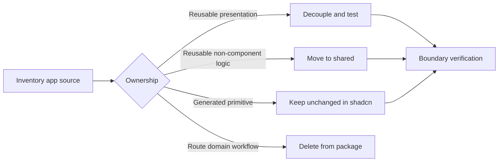

# Design: Phase 1 Clean Boundary

## Overview

Treat cleanup as an ownership decision, not a bulk import rewrite. Application-owned modules are deleted from this repository. A module is retained only when it can expose a reusable presentation contract without importing consumer code or owning business behavior.

Generated Shadcn source remains an explicit exception: it is package-owned generated code, but its source and generated aliases are not manually changed in this phase.

## Architecture



## Component

| Component              | Responsibility                                                              | Location                                   |
| ---------------------- | --------------------------------------------------------------------------- | ------------------------------------------ |
| Ownership inventory    | Record keep, move, decouple, or delete disposition for every current module | `plan/phase-1-clean-boundary/inventory.md` |
| Generated primitive    | Shadcn CLI-owned primitive; unchanged by hand                               | `app/component/shadcn/`                    |
| Presentation component | Reusable rendering, accessibility, transient UI state, and UI event         | `app/component/global/`                    |
| UI-only hook           | Reusable browser or interaction state without product behavior              | `app/hook/`                                |
| Shared utility         | Reusable non-component logic without consumer dependency                    | `shared/`                                  |
| Boundary check         | Reject forbidden dependency and ownership path                              | `internal/script/` and lint configuration  |

## Classification Rule

Delete a module when any essential responsibility is application-owned:

- route navigation or route error behavior;
- query, mutation, usecase, repository, or adapter access;
- authorization or product workflow;
- DTO, mapper, domain status, financial, ticket, studio, or check-in contract;
- product translation lookup;
- product-specific composition that has no reusable presentation API.

Retain a module only when all application concerns can be represented as data, copy, child, and callback props without reproducing a consumer domain model in this package.

Do not keep a misleading generic shell solely to preserve copied source.

## Import Rule

Hand-authored package source uses local imports internally:

```tsx
// app/component/global/example.component.tsx
import { Button } from "../shadcn/button"
import { Typography } from "./typography.component"
```

Generated Shadcn source may continue using aliases emitted by the configured Shadcn generator. The existing Oxlint exclusion isolates generated source from hand-authored import rules.

Consumers will use `@bridge/ui` public exports only after Phase 2 creates the package contract.

## Presentation Contract

Reusable copy and product behavior enter through props:

```tsx
type EmptyStateProps = {
  readonly action?: React.ReactNode
  readonly description: React.ReactNode
  readonly title: React.ReactNode
}

export function EmptyState({ action, description, title }: EmptyStateProps) {
  return (
    <section>
      <h2>{title}</h2>
      <div>{description}</div>
      {action}
    </section>
  )
}
```

The package must not replace Cue translation calls with a new package translation layer.

## Implementation Flow

1. Create a complete module inventory before deleting or refactoring source.
2. Mark generated Shadcn modules as keep-unchanged.
3. Mark obvious product folders and route-bound modules as delete.
4. Review each remaining global component against the classification rule.
5. Write a failing behavior test before decoupling each retained component.
6. Delete application-owned modules and move reusable non-component logic.
7. Replace private package aliases only in hand-authored retained source.
8. Remove dependencies no longer imported.
9. Run automated boundary, lint, type, and test checks.
10. Review the final source inventory before opening Phase 2.

## Risk & Mitigation

| Risk                                               | Mitigation                                                                                                         |
| -------------------------------------------------- | ------------------------------------------------------------------------------------------------------------------ |
| Reusable UI is deleted with product source         | Inventory and classify every module before edits; use Git history as recovery, not compatibility code.             |
| Product domain is hidden behind generic prop names | Reject contracts that mirror consumer DTO or workflow shape.                                                       |
| Cleanup becomes a broad redesign                   | Preserve visual behavior for retained components; change only ownership and dependency boundaries.                 |
| Generated Shadcn code is changed to satisfy lint   | Keep generated directory excluded and verify its diff remains empty.                                               |
| Removed dependencies break preview tooling         | Separate package source from preview support; delete obsolete preview use rather than restoring consumer coupling. |
| Boundary checks only cover known import strings    | Combine Oxlint restrictions with a source scan for forbidden package, folder, and product-i18n patterns.           |
