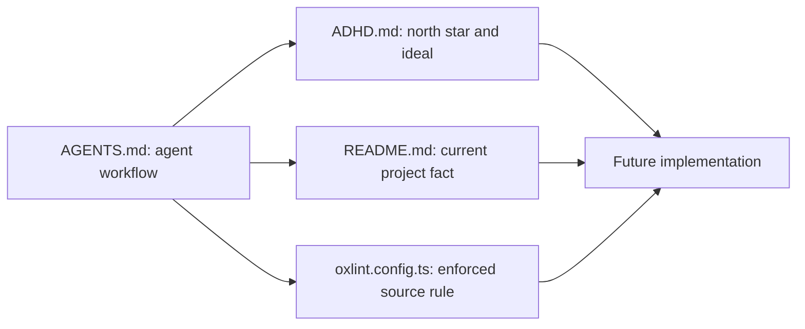

# Design: Policy Boundary

## Overview

Use four policy layer. Oxlint own deterministic source restriction. ADHD own the north star and ideal repository contract. README own current project fact and command. AGENTS own agent execution workflow and reference the other sources.

## Architecture



## Component

| Component        | Responsibility                                                           | Location           |
| ---------------- | ------------------------------------------------------------------------ | ------------------ |
| Agent guide      | Planning, tool, generated-source, and pre-commit workflow                | `AGENTS.md`        |
| North-star guide | Architecture, package, Storybook, StyleX, registry, test, migration gate | `ADHD.md`          |
| Project guide    | Current stack, source, command, and policy link                          | `README.md`        |
| Lint config      | Type assertion and import restriction                                    | `oxlint.config.ts` |

## Data Flow

1. Agent read workflow and linked repository contract.
2. Developer implement against ADHD architecture.
3. Oxlint reject supported boundary violation.

## Example Code

```ts
{
  files: ["app/**/*.{ts,tsx}"],
  excludeFiles: ["app/component/shadcn/**/*"],
  rules: {
    "typescript/consistent-type-assertions": ["error", { assertionStyle: "never" }]
  }
}
```

## Risk & Mitigation

| Risk                                        | Mitigation                                                             |
| ------------------------------------------- | ---------------------------------------------------------------------- |
| Generated Shadcn source violate strict rule | Exclude generated directory from hand-authored override.               |
| Oxlint cannot enforce semantic architecture | Keep architecture in ADHD and add dedicated verification script later. |
| Duplicate policy drift                      | AGENTS links ADHD, README, and Oxlint rather than repeating contract.  |
