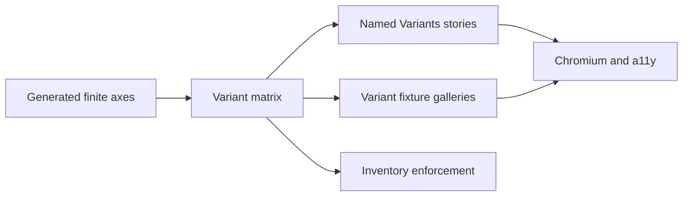

# Design: Storybook Variant Coverage

## Overview

Define one private variant matrix as the source of truth. Each affected module exports a named `Variants` story rendered by a shared variant fixture. Tests compare the matrix against story exports and explicit fixture cases.

## Architecture



## Coverage Rule

Cover every value of these explicit finite axes at least once:

- `variant`;
- `size`;
- `orientation`;
- `side`;
- `align`;
- `state`;
- `collapsible`.

Also cover semantic states when directly supported: disabled, invalid, checked/selected, open, loading, and destructive.

Do not generate every cross-product. A gallery may vary one axis while holding others at defaults.

## Components

| Component       | Responsibility                              | Location                                  |
| --------------- | ------------------------------------------- | ----------------------------------------- |
| Variant matrix  | Canonical finite axes and expected values   | `storybook/shadcn/variant-matrix.ts`      |
| Variant fixture | Real component galleries for matrix entries | `storybook/shadcn/variant-fixture.tsx`    |
| Named story     | Discoverable `Variants` catalog entry       | Existing `*.stories.tsx` files            |
| Enforcement     | Verify matrix/story/fixture consistency     | `test/internal/storybook-variant.test.ts` |

## Story Example

```tsx
export const Variants: Story = {
  render: () => <VariantFixture name="button" />
}
```

## Risk & Mitigation

| Risk                                | Mitigation                                                                             |
| ----------------------------------- | -------------------------------------------------------------------------------------- |
| Matrix drifts from generated source | Record source evidence and fail tests when matrix entries lack story/fixture coverage. |
| Galleries become unreadable         | Group by axis with labels and compact grids.                                           |
| Combinatorial explosion             | Require each finite value once, not all permutations.                                  |
| State examples fail accessibility   | Use real labels and run every story through axe.                                       |
