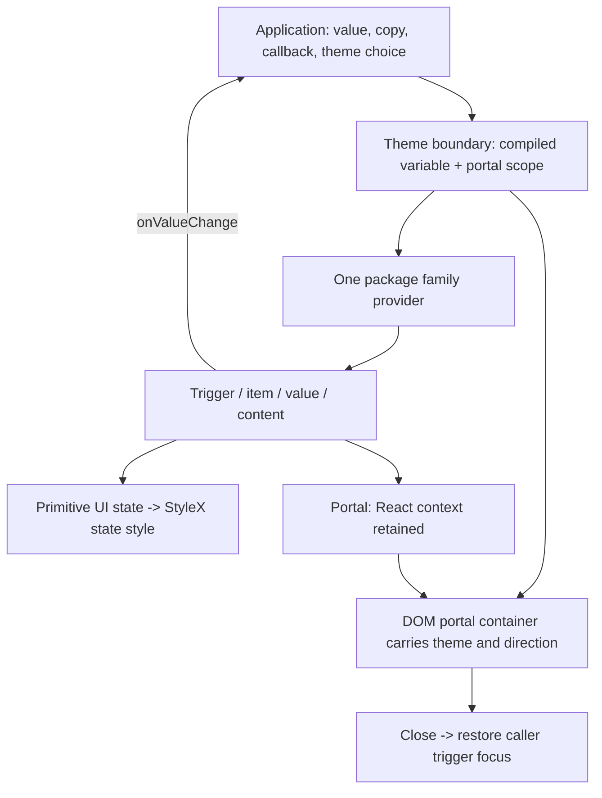
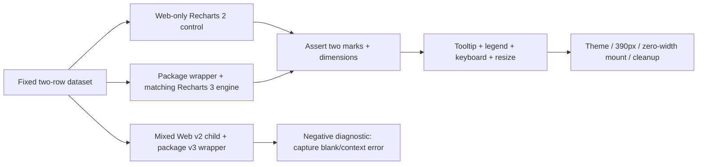
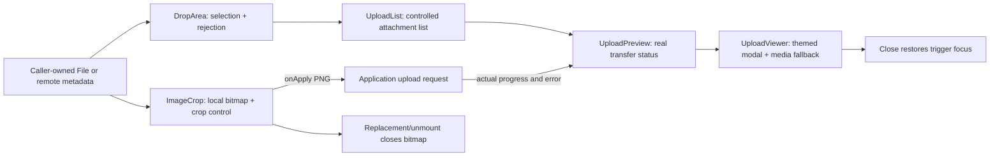

# Provider And Usecase Flow

## Context Rule

Styling and React context are separate contracts. CSS cannot join a provider from one dependency instance to a consumer from another. Keep public root/direct imports on the same module graph. A provider-only component may need no StyleX code but still needs identity, nesting and hydration tests.

React context crosses a portal; inherited CSS variable does not magically cross into an unrelated body subtree. If scoped Theme is approved, every package-owned portal must target a themed container or attach the matching compiled theme/direction to its portal root. Test nested opposite-theme overlays. Do not add a second theme storage mechanism: the application decides theme and persistence. Keep next-themes compatibility only where shipped behavior requires it.

## Provider Gap Matrix

| Family                                       | Current context owner                                  | Supported composition to prove                                     | Extra failure case                                                     |
| -------------------------------------------- | ------------------------------------------------------ | ------------------------------------------------------------------ | ---------------------------------------------------------------------- |
| Direction                                    | Base UI DirectionProvider/useDirection                 | Root provider with direct-entry consumer; nested LTR/RTL           | Portal arrow direction, SSR deterministic dir                          |
| Tooltip                                      | Base UI Provider + Root                                | Nested delay scope, focus and pointer open                         | Timer cleanup; Escape; disabled trigger treatment                      |
| Dialog / AlertDialog / Sheet                 | Base UI corresponding root                             | Trigger rendered as package Button, nested modal                   | Focus guard, scroll lock, focus restoration after removal              |
| Drawer                                       | Base UI plus wrapper-private context                   | Root/content/swipe handle from same family                         | Direction, swipe cancel, nested dialog, orphan context                 |
| Select / Combobox / Radio / Tabs / Accordion | Base UI state tree                                     | Controlled/uncontrolled, form field, nested independent root       | Missing root, disabled state, hidden form value                        |
| ToggleGroup                                  | Wrapper-private variant/size context + Base UI         | Root/direct item share value and appearance                        | Mixed module identity; single/multiple mode                            |
| MultiSelect                                  | Wrapper-private selection registry + Command + Popover | Root, trigger, item and both exported value treatments             | Async item registration, debounce cleanup, duplicate label, select-all |
| Toast                                        | Base UI Provider/manager/viewport                      | Trigger and list under matching provider                           | Queue, dismiss, action, announcement, timer disposal                   |
| Sonner                                       | Sonner singleton/Toaster + next-themes useTheme        | Theme explicit and provider-derived, distinct from Base UI Toaster | SSR/system theme, duplicate toaster, unmount timing                    |
| Sidebar                                      | Wrapper-private state + mobile hook, Sheet and Tooltip | Controlled open, icon mode, mobile portal                          | Cookie side effect, keyboard listener cleanup, two provider roots      |
| Carousel                                     | Wrapper-private context + Embla API                    | Item/next/previous/orientation from same root                      | reInit and select listener disposal, plugin lifecycle                  |
| Chart                                        | Local ChartContext + Recharts context                  | One Recharts version/instance across engine and wrapper            | Foreign v2 child as negative diagnostic, no silent blank success       |
| TsChart                                      | TanStack core/react tooltip adapter                    | Definition + default/custom renderer with matching alpha version   | Pointer tooltip, resize, offscreen remount, engine-owned style         |
| InputOTP                                     | input-otp OTPInputContext                              | Root/group/slot and masked focus caret                             | Paste, invalid char, missing provider, completion callback             |
| MessageScroller                              | @shadcn/react provider + visibility/scroll hook        | Provider, viewport, item and scroll button                         | Near-bottom vs user-scrolled-up, prepend, listener disposal            |
| Questionnaire                                | @shadcn/react state tree                               | Item/choice/input/navigation/error with caller copy                | Skip/back/submit, validation, no business-request ownership            |
| Menu / navigation / resizable / scroll area  | Respective engine state                                | Matching root/item/handle/viewport across export paths             | Resize/position observer disposal and RTL navigation                   |

These are acceptance requirements, not a report that every case currently passes. The Web spike proves nested package Tooltip content only, not arbitrary Web/package provider interchangeability.

## Chart Isolation

First inspect ResizeObserver, wrapper width/height and actual mark count; never use visible SVG alone as a chart correctness assertion. Test both compatible engine composition and deliberately foreign-version composition. Decide whether Recharts becomes a peer, is explicitly shared through an approved adapter, or remains a documented dependency with an exact compatibility requirement. Do not use a Vite dedupe override to claim a published package fix. A renderer/dependency policy change must be reviewed independently of StyleX parity.

Use a separate TsChart fixture for bar/line, tooltip, legend where the definition supplies it, and custom renderer. Keep TanStack core/react alpha 0.16.0 paired. Do not replace SVG mark semantics with layout wrappers or port Recharts to TanStack under the styling task.

## Upload Flow

URLs and transfer remain caller-owned. Never fabricate progress to demonstrate animation. Test image/video/audio/PDF/file fallback, media decode failure, unsafe URL, long filename, empty list, cumulative limit, retry/cancel/remove, focus, and callback count. Browser codec/PDF availability is not a StyleX defect. Crop retains 768px PNG output, ratio/rotation and asynchronous apply semantics; CSS changes must not alter pointer-to-canvas coordinate mapping.

## Known Boundary Debt

- Sidebar writes `sidebar_state` cookie and installs a shortcut. Preserve the current behavior during A/B; separately decide whether storage belongs in the application. Do not silently remove a shipped persistence side effect.
- Generated Dialog, menu, navigation and other module include default English copy. Owned replacement should offer caller-supplied copy/child without introducing a package translation dependency; defaults and compatibility need explicit review.
- Recharts ChartStyle generates a runtime style tag from arbitrary config. Distinguish that existing dynamic series data mechanism from forbidden StyleX runtime injection. Plan an allowlisted variable strategy or explicitly reviewed adapter, including identifier/color validation and CSP behavior.
- Mobile overflow attribution is still open. Capture offending DOM bounds at 390px in isolation, grid and dialog; apply `minWidth: 0` only when it matches the desired layout, not as a blind blanket fix.
