# Complete Phase Execution Contract

Approved execution boundary, 2026-09-08: use Effect at tooling and resource boundaries; never replace React/Base UI. Public prop/callback/ref, theme/context, packed output/SSR/hydration, resource cleanup and RC consumer seams are confirmed. Implement in vertical red-green slices, not a batch of speculative tests followed by a rewrite.

This document expands every phase at once. Each matrix row remains binding for compound slot and usecase coverage. Each slice is a separate reviewable unit; no wave may bypass a failing prerequisite. Existing decisions about registry publication, breaking API or full consumer migration are not granted by this execution approval.

## Effect Placement

| Boundary                    | Mechanism                                                                               | Explicit exclusion                                                            |
| --------------------------- | --------------------------------------------------------------------------------------- | ----------------------------------------------------------------------------- |
| Inventory/evidence input    | Schema.Struct and decodeUnknownEffect; typed failure for invalid metadata               | No runtime schema wrapping ordinary React prop                                |
| Build/verification command  | Named Effect.fn, sequential Effect.gen, typed command failure and scoped temp directory | No Effect inside JSX render or Base UI event engine                           |
| Registry read/install probe | Typed HTTP/CLI boundary; Config for endpoint; bounded retry only for idempotent read    | No retry of publish/tag mutation without existing idempotency proof           |
| Browser evidence            | Acquire/release browser/context and output directory at command boundary                | Playwright owns auto-wait and browser assertions, not TestClock               |
| Bitmap/media resource       | Scoped acquire/release and interruption only when refactoring the resource seam         | React effect owns mount/unmount; Base UI owns modal state; caller owns upload |
| Theme and component         | Pure React/context/StyleX/native callback                                               | No mandatory consumer runtime, Layer prop or Effect return type               |

Effect is currently transitive v3.22.1; @effect/vitest 0.30.0 expects Vitest 3.2 while installed Vitest is 4.1.11. Pin development Effect and @effect/vitest to the verified matching v4 RC pair `4.0.0-rc.112` for new private tooling. Do not migrate unrelated language-service tooling. If an owned runtime resource later imports Effect, explicitly declare a runtime dependency and measure its retained byte; never rely on a development dependency in published output.

Use Context.Service/Layer only for an actual reusable external seam, not every pure function. Use Schema.TaggedError, Config, Effect.fn and scoped acquisition where applicable. Tests use it.effect, typed Exit failure, Deferred/Ref/TestClock for Effect timing and cancellation. External filesystem/process/HTTP/browser may be faked; do not mock internal component/context logic. No arbitrary sleep or retry-until-green.

```mermaid
flowchart LR
  A["React mount / CLI invocation"] --> B["Explicit resource boundary"]
  B --> C["Effect decode + acquire + execute"]
  C --> D["Plain value / Promise / callback"]
  D --> E["React state and Base UI interaction"]
  A -->|"Unmount or interruption"| F["Scope finalizer releases resource"]
  C -->|"Typed failure"| G["Caller error or nonzero command exit"]
```

## W0: Reproducible Foundation

| Slice                 | Red seam and known expectation                                                               | Smallest green change                                                           | Exit evidence                                                                                        |
| --------------------- | -------------------------------------------------------------------------------------------- | ------------------------------------------------------------------------------- | ---------------------------------------------------------------------------------------------------- |
| W0.1 Inventory        | Public inventory verifier rejects a missing/duplicate row, accepts a fixed two-entry fixture | Private Effect decoder/verifier, command emits typed report/nonzero on mismatch | Real 70-row matrix matches; malformed input fails                                                    |
| W0.2 Export inventory | Packed public root/direct type/value/helper identity differs -> fail                         | AST export manifest; enumerate wildcard path without hand-maintained count      | Include MultiSelectValue and Sonner alias exception                                                  |
| W0.3 Baseline         | Evidence lacks SHA/version/toolchain/integrity -> fail validation                            | Immutable baseline capture at command boundary                                  | RC.1 SHA `4d0423a13623d524b3ac660ae8e12ab4a81ce115`; preserve original Web error/overflow/mark count |
| W0.4 Compiler parity  | Same fixture token/state differs Bun vs Vite -> fail                                         | Align explicit layer/extraction config                                          | Token, pseudo-state, media, keyframe and dynamic variable compile                                    |
| W0.5 Scope            | Source/packed output imports Effect through Button-only entry -> fail                        | Keep private Effect dependency outside package entry graph                      | Button budget and no Effect retained                                                                 |

Finish one row before starting the next. W0.1 is the first tracer bullet. Do not write all component tests in W0. Dependency compatibility and package tests must pass before committing tooling implementation.

W0.1 progress: verifier implemented with Effect v4 schema boundary and typed mismatch; command `bun cmd/verify-component-inventory.ts` verifies 70 module entries including formatter-padded Markdown. Unit/command regression is in `test/internal/component-inventory.test.ts`. AST symbol/slot enumeration remains W0.2, not claimed by this file-level check.

W0.2 progress: command now also reports 388 named value/type exports from 70 module ASTs. Babel parser is explicitly pinned because installed TypeScript 7 has no createSourceFile API. Overload deduplication and local type alias export have dedicated regression. Packed export identity/root override resolution remains a separate pending check; this snapshot does not establish full semantic symbol resolution.

## W1: Pilot Detail

| Slice               | Red behavior                                                     | Implementation and dependency                                 | Acceptance                                                                      |
| ------------------- | ---------------------------------------------------------------- | ------------------------------------------------------------- | ------------------------------------------------------------------------------- |
| W1.1 Token          | Candidate surface resolves wrong light/dark semantic value       | token.stylex.ts; compile-time value, explicit theme mapping   | Static output, scoped variable and no document mutation                         |
| W1.2 Button action  | Click/Enter/Space, disabled or form submit differs from baseline | Base UI Button + local StyleX base; preserve event/ref/render | Callback once, native form behavior, accessible name                            |
| W1.3 Button variant | Literal variant/size and helper return contract mismatch         | Compiled style map, string helper adapter, icon slot strategy | Six variant/eight size, null/default/className behavior, no lost native style   |
| W1.4 Field input    | Invalid/required label association or error list differs         | Owned Input/Label/Separator then Field slot                   | Controlled/default input, file/readonly, error deduplication and announcement   |
| W1.5 Theme portal   | Opposite nested theme popup inherits wrong variable/direction    | Minimal React theme/portal boundary; no persistence runtime   | SSR-stable id, body vs scoped portal, no cross-instance leakage                 |
| W1.6 Dialog         | Tab/Escape/scroll lock/finalFocus fails                          | Base UI Dialog family and owned Button composition            | Nested modal, unmount while open, long copy, showCloseButton, caller close copy |
| W1.7 A/B            | Same-content candidate screenshot or computed bounds regress     | Private catalog comparison, no public export flip yet         | Four viewport/theme combinations + RTL/motion/open/invalid/focus                |
| W1.8 Pack           | Production SSR/hydration needs source alias/StyleX plugin        | Precompiled candidate fixture and explicit CSS                | No dev JSX/injection/recovery; byte report; pilot go/no-go                      |

Effect applies only to W1 evidence orchestration and cleanup. Do not use Effect to express variant selection, focus, controlled value or theme selection. Keep public export promotion behind parity and API review.

## W2: Presentation And Form Detail

Execute family in this order. Each family uses the matrix's concrete usecase and test requirement; create one red test, one green implementation, then add the next state.

| Slice | Family                                                    | Red behavior / green strategy                                                              | Exit                                                                   |
| ----- | --------------------------------------------------------- | ------------------------------------------------------------------------------------------ | ---------------------------------------------------------------------- |
| W2.1  | alert, badge, card, empty, kbd, marker, skeleton, spinner | Semantic role, copy wrap and helper contract; owned native/useRender slot + compiled style | Variant/state screenshot; reduced motion; literal helper behavior      |
| W2.2  | aspect-ratio, avatar, breadcrumb                          | Ratio/image fallback/link render; preserve runtime ratio and Base UI image state           | Decode failure, ratio update, long link and ref                        |
| W2.3  | item, button-group, pagination                            | Joined corner/action nesting/current page; build on accepted Button/Separator              | Orientation/RTL, focused border not clipped, callback/current ARIA     |
| W2.4  | textarea, input-group, native-select                      | Form value/addon focus/native popup; own wrapper and native slot                           | Required/invalid/readonly, controlled/native submission                |
| W2.5  | checkbox, radio-group, switch, slider, progress, toggle   | Value/state transition; preserve Base UI engine geometry                                   | Indeterminate, multiple thumb, form/name, orientation, helper identity |
| W2.6  | drop-area                                                 | Accept/reject/disabled visual state differs                                                | Complete existing StyleX layout with local border/focus/state          | All ten example, every layout, extraction failure and callbacks |
| W2.7  | Public path promotion                                     | Root/direct import diverges                                                                | Explicit exports map accepted family to one runtime                    | Packed type/identity/SSR, no Tailwind required by candidate     |

No new Effect use in these components. V8 must include all new owned source and retain 100% each metric, not inherit generated exclusions.

## W3: Overlay And Provider Detail

| Slice | Family/dependency                     | Red behavior / implementation                                                                            | Exit                                                                        |
| ----- | ------------------------------------- | -------------------------------------------------------------------------------------------------------- | --------------------------------------------------------------------------- |
| W3.1  | popover, tooltip, hover-card          | Nested provider/portal and anchor position; keep Base UI root/positioner, style popup/arrow              | Keyboard/pointer delay, collision, theme, focus return                      |
| W3.2  | alert-dialog, sheet, drawer           | Dismiss policy/edge/swipe context; migrate family atomically                                             | All side, swipe cancel, nested lock/focus and cleanup                       |
| W3.3  | select, combobox                      | Typeahead/selection/chip/form state; build on W2 InputGroup                                              | Empty/long list, controlled/default, resize, portal theme                   |
| W3.4  | command -> multi-select + brand value | Filter/create/select-all/registry contract; one context family, no generated value mixed into owned root | Async registration, duplicate label, filtered select-all, debounce disposal |
| W3.5  | dropdown-menu -> context-menu/menubar | Keyboard/submenu/checked state; one Base UI menu graph                                                   | Open axe + focus sentinel review, RTL and pointer position                  |
| W3.6  | input-otp, toggle-group               | Shared provider slot/caret/size; preserve input-otp/Base UI                                              | Paste/delete/complete, single/multiple mode, nested group                   |
| W3.7  | toast, sonner                         | Queue/action/dismiss/theme; preserve distinct Toaster and manager                                        | Timer pause, duplicate viewport, root alias and provider-derived theme      |

React/Base UI/cmdk/input-otp/Sonner retain their own lifecycle. Effect is not inserted around third-party UI timers. Test actual browser timer behavior through deterministic trigger/assertion; use Effect TestClock only for private Effect workflow timing.

## W4: Layout And Conversation Detail

| Slice | Family                          | Red behavior / implementation                                                | Exit                                                                  |
| ----- | ------------------------------- | ---------------------------------------------------------------------------- | --------------------------------------------------------------------- |
| W4.1  | accordion, collapsible, tabs    | Expand/activation/hidden focus behavior; local slot and engine size variable | Dynamic height, manual activation, orientation, helper API            |
| W4.2  | navigation-menu, sidebar        | Menu focus/mobile collapse/shortcut; use accepted Sheet/Tooltip/Input        | Two provider roots, cookie contract unchanged, listener disposal, RTL |
| W4.3  | table, scroll-area, resizable   | Contained overflow and keyboard geometry; retain engine-owned dimension      | 390px nested grid, resize bounds, observer cleanup                    |
| W4.4  | carousel                        | Prev/next/drag and reInit/select cleanup                                     | Same Embla context, local orientation style                           | Plugin disposal, end disabled, vertical and remount                |
| W4.5  | attachment, message, bubble     | Media/action semantics and adjacency                                         | Owned slot, logical spacing, no transport state                       | MIME/copy wrap, grouped corner, no nested-button regression        |
| W4.6  | message-scroller, questionnaire | Scroll anchoring / back-skip-submit state                                    | Retain @shadcn/react provider; change presentation only               | Prepend/append and user scroll position, validation/callback order |
| W4.7  | direction                       | Root/direct nested provider mismatch                                         | Keep behavior-only re-export, no StyleX wrapper                       | Every directional family and portal LTR/RTL                        |

Lifecycle defects discovered here receive an explicit failing behavior test and separate decision record; do not silently broaden a CSS port into a behavior rewrite.

## W5: Engine And Resource Detail

| Slice | Family                    | Red seam / minimal green                                       | Exit                                                                           |
| ----- | ------------------------- | -------------------------------------------------------------- | ------------------------------------------------------------------------------ |
| W5.1  | Chart dependency          | Matching engine renders wrong mark count; negative v2 mix kept | Decide peer/shared adapter/version contract from reproduction                  | Positive two marks, negative diagnostic, no dedupe workaround                     |
| W5.2  | Recharts presentation     | Tooltip/legend/config style/resize differs                     | Whole ChartContext family, engine slot first then reviewed scoped adapter      | All 16 example, runtime config validation/CSP, zero-width recovery                |
| W5.3  | TsChart                   | Actual mark/tooltip/custom renderer behavior                   | Keep paired 0.16.0 engine; only style owned surface if needed                  | 190 render fixture + targeted interaction/lifecycle; no gratuitous Effect wrapper |
| W5.4  | Calendar                  | Range/navigation/day focus/layout differs                      | DayPicker class/slot API, accepted Button helper                               | 2/4 month, locale, disabled/range/RTL, contained mobile overflow                  |
| W5.5  | UploadPreview/Viewer/List | MIME/transfer/fallback/focus/limit behavior                    | Owned Item/Dialog/DropArea dependency; caller data and callbacks               | Complete state and unsafe URL/media decode matrix                                 |
| W5.6  | ImageCrop resource        | Replacement/unmount leaves live bitmap or stale apply          | Scoped bitmap acquisition/release at private boundary, React owns mount effect | Deferred decode interruption, close exactly once, PNG 768px and error/async apply |
| W5.7  | Resource package cost     | Resource imports leak Effect into Button                       | Explicit runtime dependency only if needed and measured, leaf isolation        | No consumer Layer/provider; root tree shaking and resource bundle report          |

Resource acquisition failure stays typed internally and maps to existing caller error/copy behavior. A scoped Effect must be run at the operation boundary with an AbortSignal/interruption path. Late bitmap resolution must close the bitmap even after cancellation. Never let a fiber outlive the React owner or move upload requests into this library.

## W6: Consolidation And Release Detail

| Slice                      | Red seam / green action                                            | Acceptance                                                                       |
| -------------------------- | ------------------------------------------------------------------ | -------------------------------------------------------------------------------- |
| W6.1 Completeness          | Inventory has unaccounted source/slot/adapter -> refuse completion | 70 original rows plus every new public module; no-style exception explicit       |
| W6.2 CSS contract          | Host sentinel changes outside isolated theme -> fail               | Approved component/global/font split; both load orders; portal scope             |
| W6.3 Dependency retirement | Candidate still needs Tailwind/generated runtime -> fail           | Remove only when every supported path resolves and all family gates pass         |
| W6.4 Package quality       | Any fmt/lint/type/test/coverage/catalog/pack gate fails -> stop    | Sequential full validation; no weakening floor or swallowing warning/error       |
| W6.5 Registry              | Version conflict/auth/install/tag issue -> typed visible failure   | Existing Changesets MR workflow, idempotent publication semantics preserved      |
| W6.6 Consumer              | Exact RC fixture regressions -> corrective RC                      | Same baseline with positive chart extension; no production Web migration         |
| W6.7 Archive               | Open task or foundation gate -> keep active                        | Archive/sync only approved completed scope; stable/migration separately reviewed |

## Commit And Continuation Protocol

Commit the expanded plan first. Commit a green slice only after repository required gate; do not include user-owned AGENTS.md. Each checkpoint records commit, current slice, red/green command, artifact revision, pending gate and next exact test. Do not claim an agent can force context compaction. Use this durable record after an externally initiated compaction. Independent subagent work may inspect or edit disjoint families only after shared token/API design is fixed; tool availability must actually support the requested model before claiming it was used.
