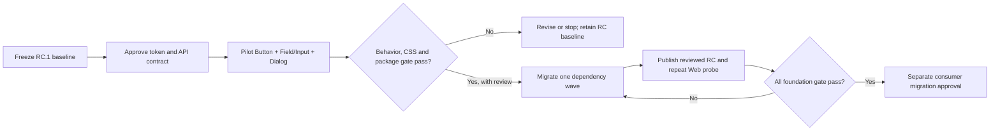

# StyleX Component Foundation

Status: Implementation authorized through test-first slices on 2026-09-08. Effect is limited to tooling/resource boundaries; never replace React/Base UI. Breaking API, publication and consumer migration remain separately gated. See `phase-detail.md` and `decision.md` for the approved execution boundary.

## Purpose

Give the package maintainer and consumer engineer an executable path from the current Tailwind-heavy RC to a precompiled StyleX presentation layer across the complete component inventory. Keep accessible behavior, composition, copy ownership, and business ownership intact. First prove Button, Field/Input and Dialog; expand only after an explicit comparison decision.

The north star remains [ADHD.md](../../ADHD.md): Cue is the canonical visual baseline; Bridge Web's old theme is not the target design. An isolated compatibility check is not a consumer migration and does not waive any foundation gate.

## Verified Snapshot

Inspected on 2026-09-08 at local commit `7150c06`. Local package manifest still says `0.1.1-rc.0`; it includes the production-JSX fix. Separately, Bridge Web's recorded installed package is `0.1.1-rc.1`. Do not treat the local checkout as the published RC. Before implementation, fetch and establish the exact release source SHA, lockfile, package integrity, toolchain and baseline artifact.

| Surface             | Observed state                                                                               | Consequence                                                               |
| ------------------- | -------------------------------------------------------------------------------------------- | ------------------------------------------------------------------------- |
| Component inventory | 63 generated module + 7 owned module; `app/component/global/` is empty                       | 70 matrix entries, including the behavior-only Direction module           |
| Generated source    | `app/component/shadcn/` remains CLI-owned                                                    | Never convert it in place by hand                                         |
| StyleX              | 0.19 range; DropArea layout only                                                             | No full component family is proven Tailwind-free                          |
| Build               | Bun and Vite use official StyleX adapter; runtime injection disabled                         | Extend existing pipeline rather than replace it                           |
| Pipeline parity     | Vite explicitly enables CSS layers; Bun does not specify the same option                     | Compare emitted order and computed style, not just successful compilation |
| Theme               | Unprefixed root variable, `.dark`, global reset, font and scrollbar rule                     | Current CSS intentionally affects the host document                       |
| Catalog             | Every generated module has a default example; 190 TsChart example files                      | Example presence is not complete state coverage                           |
| Visual regression   | Current dedicated visual suite snapshots DropArea in four configurations                     | All-family visual parity remains missing                                  |
| Export              | Root, direct alias, wildcard component entry and shared `style.css`; 79 entry paths reported | Export count is not component count; freeze actual export identity        |
| Dependency          | Recharts 3.8.0 here; Web 2.15.4 in consumer probe                                            | Context interoperability requires its own contract                        |

## Consumer Evidence

Source: Bridge Web `.eval/0908-bridge-ui-rc/report.json`, plus `openspec/changes/spike-bridge-ui-rc/findings.md` and fixture source. Evidence is historical, not a fresh execution in this planning session.

- RC.1 production SSR and four extended browser configurations reached the recorded check: light/dark at 1280px and 390px.
- No recorded hydration/browser error or unexpected request; Button, Input, Dialog, nested package TooltipProvider, Select, Popover and upload preview interaction have bounded evidence.
- TsChart evidence establishes visible SVG and remount, not tooltip, legend or every renderer behavior.
- Mixed Web Recharts children inside package ChartContainer produced zero bars; a Web-only control produced two. Root cause is not conclusively established by version difference alone.
- Mobile document width was 451px for a 390px viewport. Isolate the overflowing element before assigning fault to a chart.
- Importing package CSS changed the legacy sentinel font to Geist/Sarabun stack. This is expected evidence of global ownership, not permission for an unreviewed application-wide change.
- Extended fixture byte count: client 1,038,593; Web CSS 243,819; package CSS 913,190, all uncompressed. Not incremental app cost, gzip cost or a StyleX result.

## Scope

1. Reproducible baseline and token/override/context contract.
2. Bounded A/B experiment: Button, Field/Input, Dialog, with Label and Separator dependency support.
3. Conditional rollout plan for every inventory entry, including provider-heavy composition, chart, upload and behavior-only module.
4. Static build, CSS ownership, export continuity, SSR/hydration, accessibility, state, visual and lifecycle acceptance.
5. Changesets RC publication and the same isolated Web comparison after package verification.

## Non-Goal

No broad Web/Cue migration, app route, business state, authorization, translation service, new chart engine, mandatory Effect, consumer StyleX transform, runtime CSS injection, full redesign, or automatic stable promotion. Do not use a styling project to silently repair unrelated behavior.

## Decision Gate

Approve the experiment architecture and CSS contract first. Approval of this plan does not mean approval to implement all 70 modules at once. After the pilot, choose proceed, revise or stop using measured evidence. Tailwind remains for unmigrated generated output until the final gate, not as permanent duplicated styling for an owned component.

## Document Map

- [Design](design.md): source, build, token, override and portal contract.
- [Component matrix](component-matrix.md): all 70 module usecases, migration gap and test requirement.
- [Context flow](context-flow.md): provider, chart and upload composition.
- [Task](task.md): ordered implementation handoff and stop condition.
- [Acceptance spec](spec/stylex-contract/spec.md): measurable release gate.
- [Decision](decision.md): recommendation and unresolved approval point.

Existing `plan/foundation-build/` is a parent foundation effort, not completed by this proposal. Its older whole-source coverage wording conflicts with current ADHD runtime scope; reconcile during implementation without lowering the current gate. `plan/PROPOSAL.md` referenced by create-plan is absent; this draft follows the installed skill template rather than inventing that missing policy.
