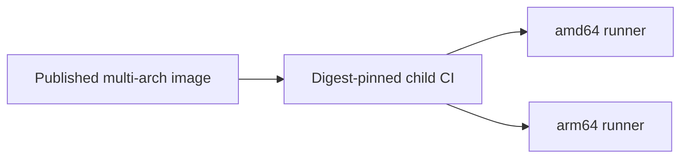

# Design: Catalog CI Image Pin

## Overview

Remove runtime image construction from repository CI. Consume the externally published service image by OCI manifest digest so Docker selects the native amd64 or arm64 child image while the runtime content remains immutable.

## Architecture



## Components

| Component        | Responsibility                             | Location                    |
| ---------------- | ------------------------------------------ | --------------------------- |
| Root CI          | Trigger verification only                  | `.gitlab-ci.yml`            |
| Child CI         | Pin service image digest                   | `deployment/.gitlab-ci.yml` |
| Runtime verifier | Validate version and selected architecture | `cmd/verify-ci-runtime.ts`  |

## Data Flow

1. Docker resolves the pinned OCI index digest.
2. Docker selects the matching runner architecture.
3. Runtime verifier confirms tool and browser revision.

## Example Code

```yaml
CATALOG_IMAGE: "registry.fountain.sellsuki.com/service/bridge-ui-catalog-runner@sha256:887a2a4f53dd81fb6cada6384e5075e18a938ff07999d65a5115378e1a74ef8c"
```

## Risks & Mitigations

| Risk                             | Mitigation                                                |
| -------------------------------- | --------------------------------------------------------- |
| Mutable tag changes unexpectedly | Pin OCI index digest.                                     |
| Wrong architecture selected      | Accept only `x64` or `arm64` and test both image targets. |
