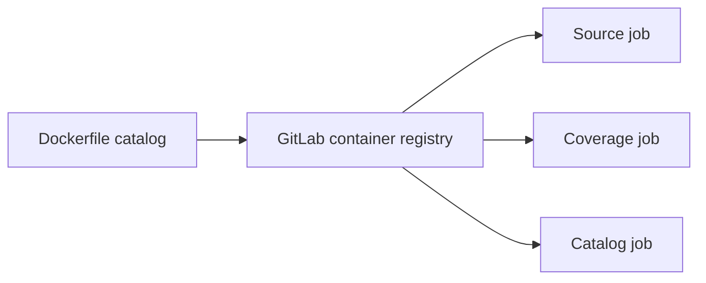

# Design: Catalog CI Image

## Overview

Build a repository-owned runtime image from the existing Bun Debian image, copy the exact Node binary, and install the version-matched Playwright browser during image creation. GitLab publishes the image when the Dockerfile changes; ordinary verification job pulls the immutable version instead of provisioning browser dependency. Preserving the existing distribution avoids invalidating Linux visual baselines.

## Architecture



## Components

| Component          | Responsibility                                         | Location                        |
| ------------------ | ------------------------------------------------------ | ------------------------------- |
| Runtime image      | Pin Bun, Node, Chromium and Linux browser dependency   | `deployment/Dockerfile.catalog` |
| Image publisher    | Build and push versioned image                         | `.gitlab-ci.yml`                |
| Child verification | Consume prebuilt runtime and skip browser installation | `deployment/.gitlab-ci.yml`     |

## Data Flow

1. A Dockerfile change builds and pushes an immutable image tag.
2. Verification job pull that image, install package dependency, and run existing command.
3. Playwright continues producing report and trace artifact.

## Example Code

```yaml
default:
  image: $CI_REGISTRY_IMAGE/ci/catalog:playwright-1.63.0-bun-1.4.1
```

## Risks & Mitigations

| Risk                                     | Mitigation                                                               |
| ---------------------------------------- | ------------------------------------------------------------------------ |
| Playwright package and image drift       | Encode both versions in image tag and add runtime verification.          |
| Arm64 image unavailable                  | Build on current arm64 runner and verify architecture.                   |
| Stale package dependency                 | Keep `bun install --frozen-lockfile` per job; cache download only later. |
| Bun.WebView loses Playwright diagnostics | Retain Playwright for the required full suite.                           |
