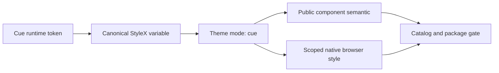

# Design: Cue Theme Alignment

## Overview

Extend the canonical StyleX variable with reusable semantic role and add an explicit `cue` Theme mode. Component consumes role rather than Cue-specific literal, preserving company package ownership while allowing exact Cue rendering.

## Architecture



## Component

| Component  | Responsibility                                        | Location                                     |
| ---------- | ----------------------------------------------------- | -------------------------------------------- |
| Theme      | Select generic light, generic dark, or exact Cue mode | `app/component/brand/stylex/theme.tsx`       |
| Token      | Define reusable semantic role                         | `app/component/brand/stylex/token.stylex.ts` |
| Button     | Expose CTA, warning, and solid destructive action     | `app/component/brand/stylex/button.tsx`      |
| Badge      | Expose success, partial-success, and warning state    | `app/component/brand/stylex/badge.tsx`       |
| Surface    | Consume card, popover, sidebar, and font role         | `app/component/brand/stylex/`                |
| Native CSS | Scope scrollbar and browser chrome to Theme           | `app/style/component.css`                    |

## Data Flow

1. Consumer renders `<Theme mode="cue">`.
2. StyleX applies exact Cue semantic variable and `color-scheme: dark`.
3. Component variant consumes semantic variable without consumer utility CSS.
4. Portal inherits the exact `cue` mode through Theme context.

## Example Code

```tsx
import { Badge, Button, Theme } from "@bridge/ui"

;<Theme mode="cue">
  <Button variant="cta">Pay now</Button>
  <Button variant="warning">Hold order</Button>
  <Button variant="destructive">Cancel order</Button>
  <Badge variant="success">Paid</Badge>
</Theme>
```

## Risk & Mitigation

| Risk                           | Mitigation                                                 |
| ------------------------------ | ---------------------------------------------------------- |
| Existing dark consumer changes | Keep generic dark mode and add a distinct Cue mode.        |
| Fill color used as text        | Keep fill and foreground role separate.                    |
| Native popup differs by OS     | Assert root color scheme and capture Bun.WebView evidence. |
| Portal falls back to light     | Carry exact mode through Theme context and test Dialog.    |
