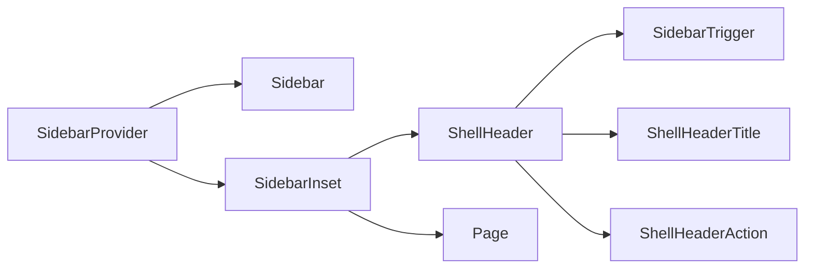

# Design: Shell Header

## Overview

Add one isolated StyleX module composed with the existing Sidebar and Page primitives. Keep width ownership in normal flex layout: the sidebar gap consumes its width and `SidebarInset` uses `flex: 1`, `width: 100%`, and `minWidth: 0` to occupy only the remainder.

## Architecture



## Components

| Component         | Responsibility                            | Location                                      |
| ----------------- | ----------------------------------------- | --------------------------------------------- |
| ShellHeader       | Sticky compact shell top bar              | `app/component/brand/stylex/shell-header.tsx` |
| ShellHeaderTitle  | Compact route heading with ellipsis       | `app/component/brand/stylex/shell-header.tsx` |
| ShellHeaderAction | Optional trailing action row              | `app/component/brand/stylex/shell-header.tsx` |
| SidebarInset      | Shrinkable remaining-width content column | `app/component/brand/stylex/sidebar.tsx`      |

## Data Flow

1. `SidebarProvider` owns expanded or collapsed state.
2. Sidebar gap width participates in the provider flex row.
3. `SidebarInset` shrinks to remaining width; its header remains `width: 100%` of that inset.
4. Caller composes trigger, title, optional action, and route page content.

## Example Code

```tsx
import { ShellHeader, ShellHeaderAction, ShellHeaderTitle } from "@bridge/ui/component/brand/stylex/shell-header"

;<ShellHeader>
  <SidebarTrigger aria-label="Toggle navigation" />
  <ShellHeaderTitle>User</ShellHeaderTitle>
  <ShellHeaderAction>{action}</ShellHeaderAction>
</ShellHeader>
```

## Risks & Mitigations

| Risk                                                    | Mitigation                                                                                                           |
| ------------------------------------------------------- | -------------------------------------------------------------------------------------------------------------------- |
| Wide route content expands the root document            | `minWidth: 0` on inset and overflow assertion with a wide table.                                                     |
| Sticky behavior is tested in the wrong scroll container | Catalog fixture scrolls the document and asserts header viewport top after scroll.                                   |
| Existing Cue theme work conflicts                       | New module uses existing `background`, `foreground`, and `border` token only; sidebar edit is one additive property. |
