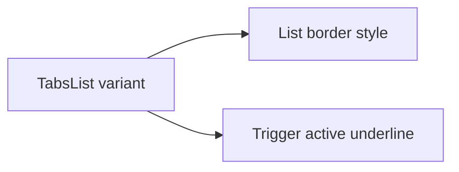

# Design: Tabs Border Bottom

## Overview

Extend the existing list variant map with `border-bottom`. The list spans available width and draws the neutral rule; the active trigger draws only a primary-color underline. Badge and icon options remain normal trigger children.

## Architecture



## Components

| Component       | Responsibility                    | Location                                                    |
| --------------- | --------------------------------- | ----------------------------------------------------------- |
| TabsList        | Expose variant and list treatment | `app/component/brand/stylex/tabs.tsx`                       |
| Catalog example | Demonstrate public option         | `internal/catalog/example/tabs/orientation-and-variant.tsx` |

## Data Flow

1. Caller passes `variant="border-bottom"`.
2. `TabsList` applies the mapped StyleX list style and data attribute.
3. Descendant active trigger receives the underline relation.

## Example Code

```tsx
<TabsList variant="border-bottom">
  <TabsTrigger value="one">One</TabsTrigger>
  <TabsTrigger value="two">Two</TabsTrigger>
</TabsList>
```

## Risks & Mitigations

| Risk                        | Mitigation                                           |
| --------------------------- | ---------------------------------------------------- |
| Existing `line` changes     | Use a separate variant style and relation selector.  |
| Border collapses list width | Set only the new horizontal treatment to full width. |
