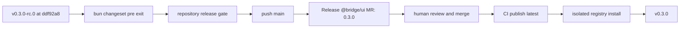

# Design: Stable 0.3.0 Release

## Overview

Promote the already published 0.3.0 RC through the existing Changesets and protected GitLab release automation. The local change only exits pre-mode and records evidence; CI owns version calculation, publication, registry verification, and tagging.

## Architecture



## Components

| Component            | Responsibility                       | Location                              |
| -------------------- | ------------------------------------ | ------------------------------------- |
| Changesets pre-state | Express explicit RC exit             | `.changeset/pre.json`                 |
| Release automation   | Calculate and publish stable version | `cmd/`, `deployment/`                 |
| Release contract     | Preserve protected-main ownership    | `plan/spec/changeset-release/spec.md` |

## Data Flow

1. Confirm the published RC tag and source.
2. Exit pre-mode with the pinned Changesets CLI through Bun.
3. Verify the unchanged package source locally.
4. Push the pre-state change to protected-main automation.
5. Review and merge the generated stable release MR.

## Example Code

```sh
bun changeset pre exit
```

## Risks & Mitigations

| Risk                            | Mitigation                                                    |
| ------------------------------- | ------------------------------------------------------------- |
| Publishing unverified source    | Promote only the fetched RC source and run the complete gate. |
| Local version/tag drift         | Do not run `changeset version`, publish, or tag locally.      |
| Irreversible bad stable version | Require review of the generated release MR before merge.      |
