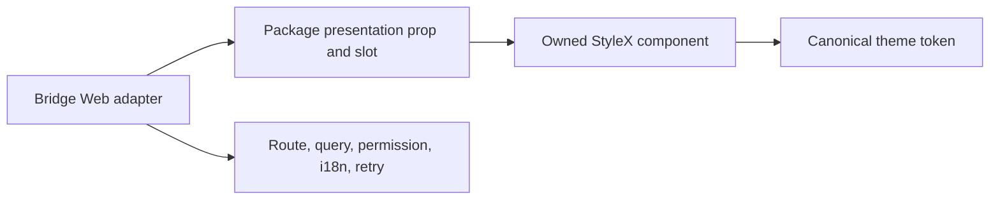

# Design: DEV-596 Component Centralization

## Overview

Add small presentation-only StyleX contracts beside the existing package Page and Table primitives. The package owns geometry, semantic slot, color token, responsive behavior, and accessibility defaults; the application continues to own copy, action wiring, domain variant mapping, and layout policy.

## Architecture



## Component

| Component       | Responsibility                                                                 | Location                                       |
| --------------- | ------------------------------------------------------------------------------ | ---------------------------------------------- |
| `TimelineStep*` | Generic vertical or horizontal progress/timeline presentation                  | `app/component/brand/stylex/timeline-step.tsx` |
| `PageToolbar`   | Responsive action/filter row inside Page composition                           | `app/component/brand/stylex/page.tsx`          |
| `DataState*`    | Semantic state surface with caller-owned media, title, description, and action | `app/component/brand/stylex/data-state.tsx`    |
| `TableFrame*`   | Bordered table viewport with optional mobile hint                              | `app/component/brand/stylex/table-frame.tsx`   |

## Data Flow

1. Consumer maps application state to a presentation variant.
2. Consumer supplies translated title, description, media, and action content.
3. Package renders semantic slot and canonical StyleX presentation.
4. Consumer handles every event and business side effect.

## Example Code

```tsx
import {
  DataState,
  DataStateAction,
  DataStateDescription,
  DataStateTitle,
  PageToolbar,
  TableFrame,
  TableFrameHint,
  TableFrameViewport
} from "@bridge/ui"

<PageToolbar aria-label="Filter">{filter}</PageToolbar>
<DataState variant="error">
  <DataStateTitle>{message.title}</DataStateTitle>
  <DataStateDescription>{message.description}</DataStateDescription>
  <DataStateAction>{retryButton}</DataStateAction>
</DataState>
<TableFrame density="compact">
  <TableFrameHint>{mobileHint}</TableFrameHint>
  <TableFrameViewport>{table}</TableFrameViewport>
</TableFrame>
```

## Risk & Mitigation

| Risk                                                        | Mitigation                                                                                                                      |
| ----------------------------------------------------------- | ------------------------------------------------------------------------------------------------------------------------------- |
| Application contract leaks into package                     | Accept only native prop, presentation variant, and child slot.                                                                  |
| Legacy timeline naming conflicts with repository grammar    | Use singular package family and let DEV-597 provide the legacy facade name.                                                     |
| Table descendant styling couples to a specific table engine | Own only frame and viewport; table cell density remains explicit through frame data and documented package Table compatibility. |
| Data state becomes a workflow component                     | No retry callback or default copy; action is caller content.                                                                    |
