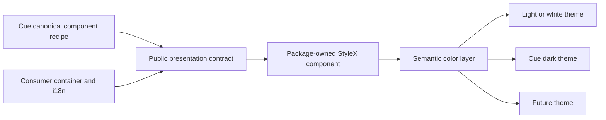

# Design: DEV-600 Cue UI Decoupling

## Overview

DEV-600 first centralizes reusable Cue presentation recipes in `@bridge/ui`. StyleX owns static geometry and semantic styling; theme providers select semantic color values only. Consumers retain application composition, business state, and translated copy.

## Architecture



## Component ownership

| Component family                              | Package responsibility                                                        | Consumer responsibility                            |
| --------------------------------------------- | ----------------------------------------------------------------------------- | -------------------------------------------------- |
| Token and Theme                               | semantic token names, color layers, scope, DOM-stable theme selection         | theme policy and application persistence           |
| Theme and Sonner                              | provider mechanics, portal scope, accessible toast presentation               | translated toast copy and action side effects      |
| Calendar                                      | date-grid geometry, keyboard focus, controlled date/range presentation        | calendar state, locale, date conversion, labels    |
| Button, Tabs, Select, Dialog                  | Cue recipe, native/ARIA behavior, migration-critical variants                 | copy, links/routes, business event handling        |
| TicketCard, TicketCover, Receipt, StatusStamp | reusable ticket-named presentation, semantic slots, responsive/a11y mechanics | ticket DTO mapping, copy, data/state/action wiring |

`Ticket` naming is not itself domain leakage: the package accepts presentation-ready data and child slots only. It never accepts a Cue DTO, fetches data, imports consumer code, or supplies product translations.

## Source and export model

- Owned source lives under `app/component/brand/stylex/`; immutable generated source remains under `app/component/shadcn/` and is not manually edited.
- Shared StyleX token/theme infrastructure lives under `app/style/` or `shared/`; it has no consumer import.
- `app/index.ts` exports only approved root APIs. Each promoted public component has one stable direct entry such as `@bridge/ui/button`, `@bridge/ui/calendar`, `@bridge/ui/ticket-card`, and `@bridge/ui/theme`.
- `@bridge/ui/style.css` contains extracted StyleX, font, narrow engine normalization, and necessary scoped adapter only. It contains neither product i18n nor a global square-radius reset.

## Theme model

Geometry, spacing, typography, layout, motion, and structural selectors are component recipe constants. Semantic token names, for example `surface`, `surface-raised`, `content`, `border`, `accent`, `focus-ring`, and status layers, resolve in each theme. Light/white, Cue dark, and future themes preserve data-slot DOM, component structure, and non-color computed geometry.

The rejected `rounded-none` forcing selector from `stylex-public-promotion` is superseded for DEV-600 only: component recipes retain their Cue-approved radii; local API variants determine intentional radius.

## Public test seams before implementation

| Seam                           | Public contract under test                                              | Test use                                           |
| ------------------------------ | ----------------------------------------------------------------------- | -------------------------------------------------- |
| `data-slot`                    | stable semantic part names                                              | role/structure and visual-state queries            |
| native prop and ref forwarding | caller `aria-*`, `id`, class, disabled, and ref reach the semantic root | accessibility and compatibility tests              |
| controlled value callbacks     | Calendar date/range, Tabs value, Select value/open, Dialog open         | interaction tests without consumer state           |
| provider boundary              | Theme selector and Sonner portal are explicit public components         | scope, theme, focus, toast tests                   |
| stable root/direct export      | root and direct entry names                                             | packed declaration/client/SSR verification         |
| CSS custom-property contract   | documented semantic tokens on the Theme boundary                        | light/dark/future geometry and color parity checks |

## Example code

```tsx
import { Button, Calendar, Theme } from "@bridge/ui"
import "@bridge/ui/style.css"

;<Theme mode="cue">
  <Button size="xl">{label}</Button>
  <Calendar mode="single" selected={date} onSelect={setDate} />
</Theme>
```

Direct stable imports are also available for migration-critical primitives:

```tsx
import { Button } from "@bridge/ui/button"
import { Calendar } from "@bridge/ui/calendar"
import { Dialog } from "@bridge/ui/dialog"
import { Tabs } from "@bridge/ui/tabs"
import { Select } from "@bridge/ui/select"
```

## Risk and mitigation

| Risk                                         | Mitigation                                                                                          |
| -------------------------------------------- | --------------------------------------------------------------------------------------------------- |
| Token work changes geometry across themes    | assert identical DOM and non-color computed style in all three themes.                              |
| Ticket presentation gains Cue business logic | expose only presentation-ready props and slots; boundary test rejects consumer and i18n imports.    |
| Migration API breaks existing Cue recipe     | characterize Cue behavior first and require public API compatibility tests before source promotion. |
| Provider/portal leaks styles                 | test Theme and Sonner scope with portal and outside sentinels.                                      |
