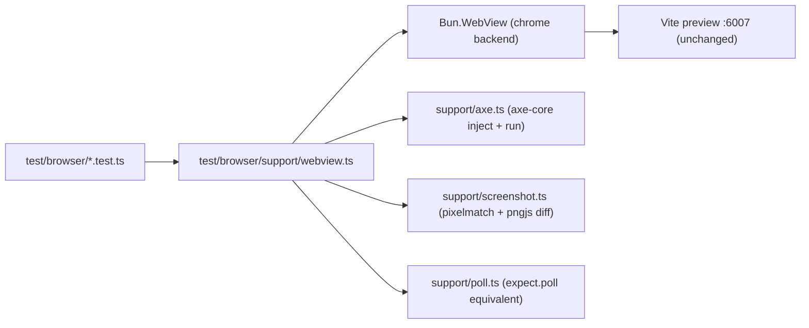

# Design: Convert Playwright Catalog Suite to Bun.WebView

## Overview

Replace Playwright's `page`/`expect`/`AxeBuilder`/CDP-session API with a thin harness built directly on `Bun.WebView` + `node:assert/strict` + `bun:test`. Each spec becomes a plain `test()` (or looped `test()`) function that opens one `Bun.WebView` (Chrome backend, headless), drives it with harness helpers, asserts with `expect` from `bun:test`, and disposes the view (`using`/`try+finally`). No custom test runner, reporter, or fixture layer is introduced — `bun test` already provides parallel file execution (`--parallel`), retries (`--retry`), reporters (`--reporter=junit|dots`), and sharding (`--shard`), which covers what `playwright.config.ts` provided.

## Architecture



## Components

| Component                               | Responsibility                                                                                                                                                                                                                                                            | Location                             |
| --------------------------------------- | ------------------------------------------------------------------------------------------------------------------------------------------------------------------------------------------------------------------------------------------------------------------------- | ------------------------------------ |
| `openCatalog(pathAndHash, options)`     | Create a `Bun.WebView`, navigate to `${baseURL}${pathAndHash}`, return `{ view, dispose }`                                                                                                                                                                                | `test/browser/support/webview.ts`    |
| `locator(view, selector)`               | CSS-selector wrapper exposing `.click()`, `.text()`, `.count()`, `.boundingBox()`, `.css(prop)`, `.attr(name)`, `.isVisible()`, `.focus()`, `.evaluate(fn)` via `view.evaluate` + `view.click(selector)`                                                                  | `test/browser/support/locator.ts`    |
| `byRole(view, role, { name, exact })`   | Builds an ARIA-role CSS/JS query (mirrors Playwright's accessible-name algorithm using `role=` attribute + `aria-label`/text content matching) evaluated in-page, returns a `locator`-shaped handle keyed by a generated `data-webview-ref` attribute for stable re-query | `test/browser/support/role.ts`       |
| `pollUntil(fn, { timeout, interval })`  | Generic async poll loop replacing `expect.poll`                                                                                                                                                                                                                           | `test/browser/support/poll.ts`       |
| `runAxe(view, options)`                 | Injects vendored `axe-core/axe.min.js` (already a resolvable package) once per view, runs `axe.run` with the same WCAG tag matrix as today                                                                                                                                | `test/browser/support/axe.ts`        |
| `uploadFile(view, inputSelector, file)` | Base64-encodes a `Uint8Array`/canvas-generated PNG, sets it on the `<input type=file>` via a CDP-free in-page `DataTransfer` + `input.files` assignment, dispatches trusted-equivalent `change`/`input` events                                                            | `test/browser/support/upload.ts`     |
| `expectScreenshot(view, name, options)` | Captures `view.screenshot()`, diffs against `test/browser/support/__screenshot__/<name>-<platform>.png` baseline using `pixelmatch`, writes actual+diff PNGs to `.eval/` on mismatch, supports `BUN_UPDATE_SNAPSHOTS=1` to (re)write baselines                            | `test/browser/support/screenshot.ts` |
| `withHeapSession(view)`                 | Wraps `view.cdp("HeapProfiler.collectGarbage")` / `Runtime.getHeapUsage` / `Memory.getDOMCounters` calls used only by `memory.test.ts`                                                                                                                                    | `test/browser/support/cdp.ts`        |
| `CATALOG_BASE_URL`                      | `process.env.CATALOG_URL ?? "http://127.0.0.1:6007"` constant, matching `playwright.config.ts`'s `baseURL`                                                                                                                                                                | `test/browser/support/env.ts`        |

## Data Flow

1. `bunfig.toml` test root stays `./test/internal`; `catalog:test` script explicitly globs `test/browser/**/*.test.ts` so `bun test` discovers them without changing the default root (mirrors the existing pattern already proven for `test/browser-webview-poc`).
2. `catalog:test` script: `bun catalog:build && bunx vite preview --port 6007 --strictPort --host 127.0.0.1 & wait-for-port 6007 && bun test test/browser --timeout 30000; kill $!` — a small `cmd/run-catalog-test.ts` orchestrator owns start/stop of the preview server (replacing Playwright's `webServer` option) since `bun test` has no built-in server lifecycle.
3. Each spec imports `{ openCatalog, byRole, locator, expect } from "./support"` (barrel), opens a view per test (or per loop iteration), performs actions, asserts, and disposes via `using`.
4. CI: one Chrome instance reused across the whole file's views (`Bun.WebView` chrome backend spawns once per process and reuses via `Target.createTarget` — confirmed in `bun.d.ts`), so parallel file workers (`bun test --parallel`) each get their own Chrome subprocess; single-worker default in CI (matches current `workers: 1` in CI) keeps Chromium load bounded on the shared runner.

## Example Code

```typescript
// test/browser/support/webview.ts
import { CATALOG_BASE_URL } from "./env"

export async function openCatalog(hashPath: string, options: { width?: number; height?: number } = {}) {
  const view = new Bun.WebView({
    width: options.width ?? 1280,
    height: options.height ?? 720,
    backend: { type: "chrome", url: false }
  })
  await view.navigate(`${CATALOG_BASE_URL}${hashPath}`)
  return view
}
```

```typescript
// test/browser/tab-example.test.ts
import { afterEach, describe, expect, test } from "bun:test"
import { byRole, locator, openCatalog } from "./support"

for (const variant of ["default", "line", "capsule"]) {
  test(`${variant} tab supports plain, badge and icon labels`, async () => {
    await using view = await openCatalog(`/?preview&theme=dark#tabs/${variant}`)
    await expect(byRole(view, "tab", { name: "Assets" })).toBeVisible()
    await expect(
      locator(view, byRole(view, "tab", { name: "Colors 32" }).selector + ' [data-slot="badge"]')
    ).toBeVisible()
    const icon = locator(view, byRole(view, "tab", { name: "Todo 4" }).selector + " svg")
    await expect(icon).toBeVisible()
    await expect(icon).toHaveCSS("width", "16px")
    await expect(icon).toHaveCSS("height", "16px")
  })
}
```

`expect(locator).toBeVisible()` / `.toHaveCSS()` are custom `bun:test` matchers registered once in `test/browser/support/matcher.ts` via `expect.extend`, mirroring Playwright's assertion vocabulary so spec bodies stay close to the original.

## Risks & Mitigations

| Risk                                                                                                             | Mitigation                                                                                                                                                                                                                                                                                                                                                  |
| ---------------------------------------------------------------------------------------------------------------- | ----------------------------------------------------------------------------------------------------------------------------------------------------------------------------------------------------------------------------------------------------------------------------------------------------------------------------------------------------------- |
| No native `webServer` lifecycle in `bun test`                                                                    | Small `cmd/run-catalog-test.ts` orchestrator starts Vite preview, polls port, runs `bun test test/browser`, tears down server in `finally`.                                                                                                                                                                                                                 |
| No accessible-name/role engine built into `Bun.WebView`                                                          | Hand-roll a minimal `byRole` in-page JS query (attribute `role=`/implicit role map + `aria-label`/text content), scoped to the actual role vocabulary used in specs (button, tab, menu, menuitem, dialog, combobox, option, alert, status, navigation, link, region, separator, checkbox, switch, radio, slider). Verified per-conversion against real DOM. |
| Screenshot diffing needs pixel comparison                                                                        | `pngjs` is already present in `node_modules` (transitive); add `pixelmatch` as a direct devDependency (pure JS, zero native deps) instead of hand-rolling comparison.                                                                                                                                                                                       |
| Losing Playwright's actionability waits (auto-retry until element visible/stable)                                | `Bun.WebView.click(selector)` already implements actionable-wait per `bun.d.ts` docs (attached, visible, stable 2 frames, topmost). `locator.evaluate`/text/attr reads add a short `pollUntil` wrapper for elements that must first exist.                                                                                                                  |
| Losing Playwright parallel worker isolation across spec files                                                    | `bun test --parallel` isolates each file's globals; CI keeps `--parallel=1` equivalent (no flag) to match current `workers: 1` in CI, `--parallel` locally optional.                                                                                                                                                                                        |
| `catalog.spec.ts`'s `readdirSync`-driven dynamic per-example test generation                                     | Port directly — `bun:test`'s `test()` also supports being called in a loop at module scope; behavior is identical to Playwright's dynamic generation.                                                                                                                                                                                                       |
| CI Docker image currently installs Playwright's Chromium (`bunx playwright@1.63.0 install --with-deps chromium`) | Replace with a plain Chromium/Google Chrome apt install (Debian `chromium` package) so `Bun.WebView({ backend: { type: "chrome" } })` auto-detects it; set `BUN_CHROME_PATH` if needed.                                                                                                                                                                     |
