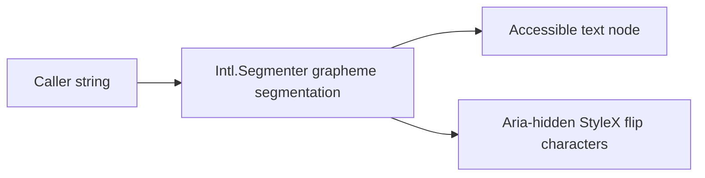

# Design: Flip Text

## Overview

`FlipText` is a decorative text presentation component. The caller supplies the full text and optional timing controls; the component renders one visually-hidden semantic text node plus an aria-hidden StyleX-animated grapheme layer.

## Architecture

## Components

| Component  | Responsibility                                                        | Location                                   |
| ---------- | --------------------------------------------------------------------- | ------------------------------------------ |
| `FlipText` | Segment content, calculate delays, provide semantic and visual layers | `app/component/brand/stylex/flip-text.tsx` |

## Data Flow

1. The caller passes one text string and timing preferences.
2. The component separates caller-selected word segments, then uses `Intl.Segmenter` for grapheme clusters inside them.
3. StyleX renders the individual visual characters with CSS custom-property timing and a rotate-X keyframe.
4. `prefers-reduced-motion` reduces the animation duration to zero while the readable text remains unchanged.

## Risks & Mitigations

| Risk                                           | Mitigation                                                                |
| ---------------------------------------------- | ------------------------------------------------------------------------- |
| Screen readers announce every visual character | Retain one visually hidden copy and set the animated layer `aria-hidden`. |
| Thai marks/emoji split incorrectly             | Use platform `Intl.Segmenter` grapheme segmentation.                      |
| Infinite animation harms motion-sensitive user | Zero animation duration under reduced motion.                             |
