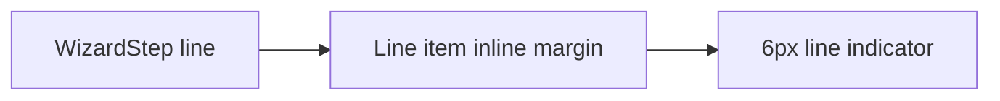

# Design: Wizard Step Line Spacing

## Overview

The horizontal line item owns its segment spacing because inter-item connectors are hidden for this variant. Its indicator remains full width within the item.

## Architecture



## Components

| Component         | Responsibility                            | Location                                           |
| ----------------- | ----------------------------------------- | -------------------------------------------------- |
| WizardStep styles | Set line segment size and sibling spacing | `app/component/brand/stylex/wizard-step.tsx`       |
| Browser test      | Assert rendered segment size and gap      | `test/browser/dev-600-presentation-states.test.ts` |

## Example Code

```tsx
<WizardStep variant="line">
  <WizardStepItem>
    <WizardStepIndicator />
  </WizardStepItem>
  <WizardStepItem>
    <WizardStepIndicator />
  </WizardStepItem>
</WizardStep>
```

## Risks & Mitigations

| Risk                               | Mitigation                                  |
| ---------------------------------- | ------------------------------------------- |
| Spacing shifts labels unexpectedly | Verify the catalog layout with Bun.WebView. |
