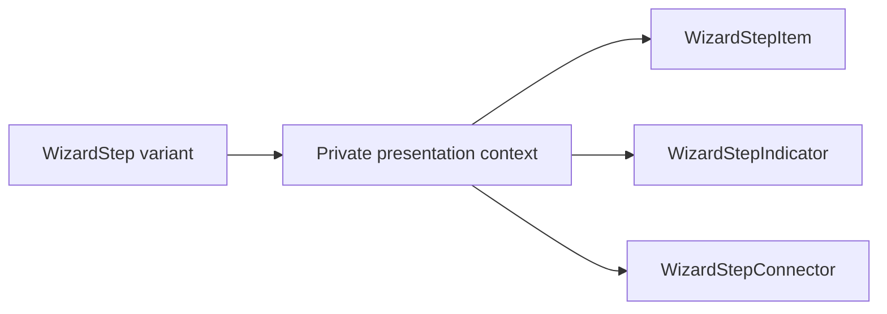

# Design: Wizard Step Variants

## Overview

WizardStep will provide its root presentation values to compound child slots through a private React context. This preserves the existing consumer composition while letting `number` and `line` consistently coordinate item, indicator, connector, and label layout.

## Architecture



## Components

| Component      | Responsibility                                          | Location                                          |
| -------------- | ------------------------------------------------------- | ------------------------------------------------- |
| WizardStep     | Expose variant and provide presentation context         | `app/component/brand/stylex/wizard-step.tsx`      |
| Compound slots | Apply coordinated variant layout while preserving props | `app/component/brand/stylex/wizard-step.tsx`      |
| Catalog states | Display all supported variants                          | `internal/catalog/example/wizard-step/states.tsx` |

## Data Flow

1. WizardStep receives orientation, variant, and tone.
2. Child slots read the inherited presentation value unless explicitly supplied a compatible local prop.
3. Slots render their current state metadata and variant geometry.

## Example Code

```tsx
<WizardStep variant="line" aria-label="Event setup">
  <WizardStepItem state="current">
    <WizardStepIndicator>1</WizardStepIndicator>
    <WizardStepLabel>
      <WizardStepTitle>Location</WizardStepTitle>
    </WizardStepLabel>
  </WizardStepItem>
</WizardStep>
```

## Risks & Mitigations

| Risk                               | Mitigation                                                                                  |
| ---------------------------------- | ------------------------------------------------------------------------------------------- |
| Existing composed markup regresses | Preserve slot names, native props, and state data attributes; run existing component tests. |
