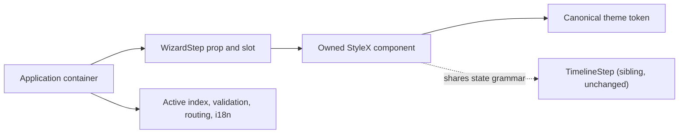

# Design: Wizard Step

## Overview

Add a presentation-only StyleX component family, `WizardStep`, beside the
existing `TimelineStep` family. Same architectural tier as the DEV-596
reusable-presentation components: package owns geometry, semantic slot,
color token, and accessibility default; the application owns active-step
index, validation, copy, and navigation side effect.

## Architecture



## Component

| Component                                   | Responsibility                                                              | Location                                     |
| ------------------------------------------- | --------------------------------------------------------------------------- | -------------------------------------------- |
| `WizardStep`                                | Root list container; owns `orientation`, `variant`, `tone`                  | `app/component/brand/stylex/wizard-step.tsx` |
| `WizardStepItem`                            | Per-step wrapper; owns `state`; `useRender` for click-to-revisit            | same file                                    |
| `WizardStepIndicator`                       | Circular/dot indicator; renders number, checkmark, or error icon by `state` | same file                                    |
| `WizardStepConnector`                       | Line between indicators; horizontal or vertical geometry                    | same file                                    |
| `WizardStepLabel`                           | Flex wrapper for title + description, laid out beside the indicator         | same file                                    |
| `WizardStepTitle` / `WizardStepDescription` | Text slots                                                                  | same file                                    |
| `WizardStepCounter`                         | Optional "Step X of Y" text slot                                            | same file                                    |

## Data Flow

1. Consumer computes `state` per step (`upcoming` \| `current` \|
   `completed` \| `error`) from its own active-index/validation state.
2. Consumer renders `WizardStep` with `orientation`/`variant`/`tone` and
   maps its step list to `WizardStepItem` children, each carrying `state`.
3. Package renders the corresponding StyleX visual for that state; for
   `completed` items, the consumer may pass `render={<button/>}` to make
   the step clickable-to-revisit.
4. Consumer owns everything past the click: index change, route change,
   revalidation.

## Example Code

```tsx
// app/component/brand/stylex/wizard-step.tsx (excerpt)
import * as stylex from "@stylexjs/stylex"
import type { ComponentProps } from "react"
import { CheckIcon, XIcon } from "lucide-react"
import { mergeProps } from "@base-ui/react/merge-props"
import { useRender } from "@base-ui/react/use-render"

import { token } from "./token.stylex"

const wizardStepOrientation = { horizontal: "horizontal", vertical: "vertical" } as const
const wizardStepVariant = { number: "number", dot: "dot", line: "line" } as const
const wizardStepTone = { hard: "hard", soft: "soft" } as const
const wizardStepState = {
  upcoming: "upcoming",
  current: "current",
  completed: "completed",
  error: "error"
} as const

type ValueOf<T> = T[keyof T]
export type WizardStepOrientation = ValueOf<typeof wizardStepOrientation>
export type WizardStepVariant = ValueOf<typeof wizardStepVariant>
export type WizardStepTone = ValueOf<typeof wizardStepTone>
export type WizardStepState = ValueOf<typeof wizardStepState>

const style = stylex.create({
  root: { display: "flex", width: "100%", minWidth: 0 },
  horizontal: {
    flexDirection: "row",
    alignItems: "flex-start",
    overflowX: "auto",
    overscrollBehaviorInline: "contain"
  },
  vertical: { flexDirection: "column" },
  indicator: {
    position: "relative",
    zIndex: 1,
    display: "flex",
    flexShrink: 0,
    alignItems: "center",
    justifyContent: "center",
    borderRadius: "50%",
    borderWidth: 1.5,
    borderStyle: "solid",
    borderColor: token.border,
    backgroundColor: token.background,
    color: token.mutedForeground,
    fontSize: 13,
    fontWeight: 600
  },
  completed: { borderColor: token.primary, backgroundColor: token.primary, color: token.primaryForeground },
  current: { borderColor: token.primary, backgroundColor: token.primary, color: token.primaryForeground },
  currentSoft: {
    borderColor: token.primary,
    backgroundColor: `color-mix(in oklch, ${token.primary}, transparent 85%)`,
    color: token.primary
  },
  error: { borderColor: token.destructive, backgroundColor: token.destructive, color: token.destructiveForeground }
  // ...connector, label, title, description, counter rules mirror timeline-step.tsx conventions
})

export function WizardStep({
  className,
  orientation = "horizontal",
  variant = "number",
  tone = "hard",
  ...prop
}: ComponentProps<"div"> & {
  orientation?: WizardStepOrientation
  variant?: WizardStepVariant
  tone?: WizardStepTone
}) {
  return (
    <div
      data-slot="wizard-step"
      data-orientation={orientation}
      data-variant={variant}
      data-tone={tone}
      {...prop}
      className={[
        stylex.props(stylex.defaultMarker(), style.root, orientation === "vertical" ? style.vertical : style.horizontal)
          .className,
        className
      ]
        .filter(Boolean)
        .join(" ")}
    />
  )
}

export function WizardStepItem({
  className,
  state = "upcoming",
  render,
  ...props
}: useRender.ComponentProps<"div"> & { state?: WizardStepState }) {
  return useRender({
    defaultTagName: "div",
    props: mergeProps<"div">(
      { "data-slot": "wizard-step-item", "data-state": state, className: [/* ... */].filter(Boolean).join(" ") },
      props
    ),
    render,
    state: { slot: "wizard-step-item", state }
  })
}

export function WizardStepIndicator({
  className,
  state = "upcoming",
  tone = "hard",
  children,
  ...prop
}: ComponentProps<"div"> & { state?: WizardStepState; tone?: WizardStepTone }) {
  return (
    <div
      data-slot="wizard-step-indicator"
      data-state={state}
      {...prop}
      className={[
        stylex.props(
          style.indicator,
          state === "completed" && style.completed,
          state === "current" && (tone === "soft" ? style.currentSoft : style.current),
          state === "error" && style.error
        ).className,
        className
      ]
        .filter(Boolean)
        .join(" ")}>
      {state === "completed" ? (
        <CheckIcon width={14} height={14} />
      ) : state === "error" ? (
        <XIcon width={12} height={12} />
      ) : (
        children
      )}
    </div>
  )
}
```

## Risk & Mitigation

| Risk                                                                                                       | Mitigation                                                                                                                                                                             |
| ---------------------------------------------------------------------------------------------------------- | -------------------------------------------------------------------------------------------------------------------------------------------------------------------------------------- |
| Duplicating `TimelineStep`'s connector/token logic diverges silently over time                             | Reuse identical `token.primary` / `token.border` / `token.muted` formulas verbatim; document the shared vocabulary in the spec so future edits to one are checked against the other.   |
| `error` state has no equivalent on `TimelineStep`, risking API drift between the two families              | Document as an intentional, wizard-specific addition in `decision.md`; do not backport to `TimelineStep` without a separate proposal.                                                  |
| New `useRender`-based `WizardStepItem` opens an accidental interactive-when-upcoming bug                   | Only pass `render` from `completed` items in the catalog example; add a component test asserting `upcoming`/`current`/`error` default to a non-interactive `<div>`.                    |
| Catalog inventory test (`test/internal/catalog.test.ts`) requires an exact `default.tsx` per public family | Add `wizard-step` to `catalogOnlyStylexName`-equivalent export set (direct package export) so the inventory check picks it up automatically once `package.json` lists `./wizard-step`. |
