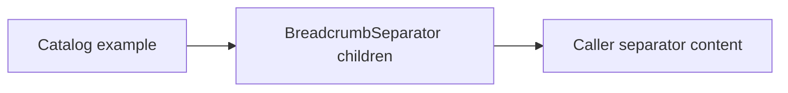

# Design: Breadcrumb Custom Separator

## Overview

The public `BreadcrumbSeparator` component uses its children when present and renders the ChevronRight icon otherwise. The change uses the existing child-content seam in the catalog and regression test.

## Architecture



## Components

| Component           | Responsibility                                | Location                                          |
| ------------------- | --------------------------------------------- | ------------------------------------------------- |
| BreadcrumbSeparator | Renders caller content or its default chevron | `app/component/brand/stylex/breadcrumb.tsx`       |
| Breadcrumb example  | Demonstrates a slash separator                | `internal/catalog/example/breadcrumb/default.tsx` |

## Data Flow

1. A consumer passes separator content as `BreadcrumbSeparator` children.
2. The component renders those children instead of the default chevron.

## Example Code

```tsx
<BreadcrumbSeparator>/</BreadcrumbSeparator>
```

## Risks & Mitigations

| Risk                                         | Mitigation                                                |
| -------------------------------------------- | --------------------------------------------------------- |
| Custom content regresses to the default icon | Assert caller content through the public render contract. |
