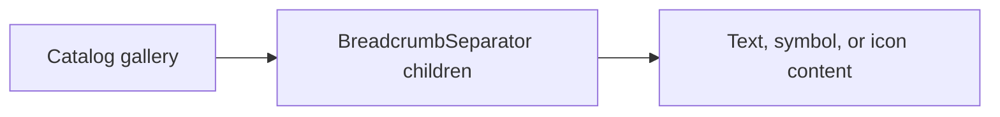

# Design: Breadcrumb Separator Gallery

## Overview

The gallery uses the current `BreadcrumbSeparator` child-content API. Each compact breadcrumb shows a distinct supported separator: default icon, text, symbols, and an icon element.

## Architecture



## Components

| Component           | Responsibility                    | Location                                            |
| ------------------- | --------------------------------- | --------------------------------------------------- |
| BreadcrumbSeparator | Renders caller separator content  | `app/component/brand/stylex/breadcrumb.tsx`         |
| Separator gallery   | Displays supported customizations | `internal/catalog/example/breadcrumb/separator.tsx` |

## Data Flow

1. The gallery maps each separator example to a Breadcrumb composition.
2. `BreadcrumbSeparator` renders supplied children or its default fallback.

## Example Code

```tsx
<UI.BreadcrumbSeparator>•</UI.BreadcrumbSeparator>
```

## Risks & Mitigations

| Risk                                   | Mitigation                                                       |
| -------------------------------------- | ---------------------------------------------------------------- |
| Gallery implies a closed set of values | Label examples as caller content rather than component variants. |
