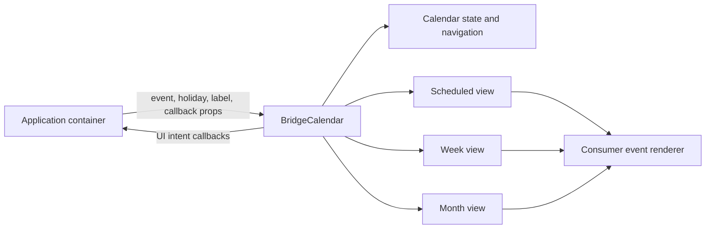

# Design: Bridge Calendar Extraction

## Overview

`BridgeCalendar` becomes an owned presentation component, distinct from the existing `Calendar` date picker. The component owns local view/date interaction and visual layout; the consumer owns domain mapping, copy, persistence, and optional content renderers.

The extracted component uses StyleX and existing package primitives. It must not import from `@bridge/web`, product i18n, Phosphor, Tailwind utilities, or product responsive hooks.

## Architecture



## Components

| Component          | Responsibility                                                                                  | Location                                                |
| ------------------ | ----------------------------------------------------------------------------------------------- | ------------------------------------------------------- |
| `BridgeCalendar`   | Public root, controlled/uncontrolled view and date, header composition, view dispatch.          | `app/component/brand/stylex/bridge-calendar.tsx`        |
| Calendar state     | View/date navigation, accessible tab behavior, and callback synchronization.                    | Same module unless a separate context module is needed. |
| Scheduled view     | Day-grouped event list, empty state slot, and pagination sentinel.                              | Same feature directory.                                 |
| Week view          | All-day lane, timed grid, overlap layout, current-time indicator, holidays, and slot selection. | Same feature directory.                                 |
| Month view         | Month grid, holiday context, event overflow, empty-day selection, and drop intent.              | Same feature directory.                                 |
| Event presentation | Default token-based event card plus optional `renderEvent` override.                            | Same feature directory.                                 |

## Data Flow

1. The application maps domain data to `BridgeCalendarEvent` and `BridgeCalendarHoliday` before rendering.
2. `BridgeCalendar` owns local state only when `view` or `date` is uncontrolled; controlled values remain authoritative.
3. A navigation or tab action calculates the next period and calls `onViewChange` or `onDateChange`; no fetch or mutation happens in the package.
4. Views derive visible event/holiday ranges and invoke callbacks for event activation, slot selection, drop intent, and pagination.
5. Consumer render functions receive the normalized UI data and return product-specific content without leaking product imports into the package.

## Public API Shape

```tsx
// app/component/brand/stylex/bridge-calendar.tsx
export const bridgeCalendarView = {
  scheduled: "scheduled",
  week: "week",
  month: "month"
} as const

export type BridgeCalendarView = ValueOf<typeof bridgeCalendarView>

export type BridgeCalendarEvent = {
  id: string
  title: ReactNode
  start: Date
  end: Date
  tone?: "neutral" | "info" | "success" | "warning" | "danger"
  meta?: ReactNode
  icon?: ReactNode
  allDay?: boolean
  disabled?: boolean
}

export type BridgeCalendarHoliday = {
  id: string
  title: ReactNode
  start: Date
  end: Date
}

export type BridgeCalendarLabels = {
  previous: string
  next: string
  today: ReactNode
  view: Record<BridgeCalendarView, ReactNode>
  scheduledEmpty?: ReactNode
  loadMore?: ReactNode
  moreEvent: (count: number) => ReactNode
  weekday: readonly ReactNode[]
  period: (context: BridgeCalendarPeriodContext) => ReactNode
  time: (hour: number, minute?: number) => ReactNode
  currentTime: string
}

export type BridgeCalendarProps = {
  events: readonly BridgeCalendarEvent[]
  holidays?: readonly BridgeCalendarHoliday[]
  view?: BridgeCalendarView
  defaultView?: BridgeCalendarView
  date?: Date
  defaultDate?: Date
  labels: BridgeCalendarLabels
  action?: ReactNode
  renderEvent?: (event: BridgeCalendarEvent, context: BridgeCalendarEventContext) => ReactNode
  renderEmpty?: () => ReactNode
  onViewChange?: (view: BridgeCalendarView) => void
  onDateChange?: (date: Date) => void
  onEventActivate?: (event: BridgeCalendarEvent) => void
  onSlotSelect?: (selection: BridgeCalendarSlotSelection) => void
  onSlotDrop?: (selection: BridgeCalendarSlotSelection) => void
  onLoadMore?: () => void
  hasMore?: boolean
  isLoadingMore?: boolean
  weekStartsOn?: 0 | 1 | 2 | 3 | 4 | 5 | 6
}
```

`BridgeCalendarLabels` is required because visible copy, including period, weekday names, time-ruler labels, current-time announcements, and overflow text, is product-owned. `weekday` remains Sunday-first and `weekStartsOn` controls display order. The default event card receives only generic tone, title, icon, and meta data; schedule status and queue labels remain consumer concerns.

## Source Migration Map

| Bridge Web source                                    | Extraction treatment                                                                                                                                     |
| ---------------------------------------------------- | -------------------------------------------------------------------------------------------------------------------------------------------------------- |
| `bridge-calendar.tsx`, `calendar-context.tsx`        | Rebuild as the public controlled/uncontrolled root with no unused `events`, loading, or status context state.                                            |
| `bridge-scheduled-view.tsx`                          | Preserve grouping, sentinel, and selection intent; replace fixed empty/FAB/copy with consumer slots and labels.                                          |
| `bridge-week-view.tsx`                               | Preserve overlap layout, visible holiday context, pointer selection, and current-time marker; use labels and tokens.                                     |
| `bridge-month-view.tsx`                              | Preserve holiday display, overflow, empty-day selection, and generic HTML drop intent; use labels and tokens.                                            |
| `bridge-event-card.tsx`, `bridge-event-pill.tsx`     | Replace queue status and translated time copy with generic tone/meta default rendering and `renderEvent`.                                                |
| `bridge-view-tabs.tsx`, `bridge-calendar-header.tsx` | Replace i18n, product typography, mobile hook, and Phosphor icons with labels, slots, package typography, and Lucide icons already shipped by Bridge UI. |
| `status-mapping.ts`, feature mappers                 | Leave in Bridge Web or other consumers; do not publish.                                                                                                  |

## Risks & Mitigations

| Risk                                                                                         | Mitigation                                                                                                                                                                    |
| -------------------------------------------------------------------------------------------- | ----------------------------------------------------------------------------------------------------------------------------------------------------------------------------- |
| `Calendar` already names the date picker export.                                             | Preserve it; use `BridgeCalendar` and `@bridge/ui/bridge-calendar` for the schedule calendar.                                                                                 |
| Current source has inconsistent controlled props (`view` is initial-only, `date` is unused). | Define and test explicit controlled/uncontrolled semantics before porting layout.                                                                                             |
| Current event contract is queue-shaped.                                                      | Reduce to generic time range and presentation fields; require consumer mapping.                                                                                               |
| Browser-only APIs are used for scrolling and pagination.                                     | Guard observers and document client-only behavior; prove SSR render has no browser access during render.                                                                      |
| Pointer-only slot selection is inaccessible.                                                 | Expose equivalent slot selection through focusable day/time controls or document a keyboard interaction design before implementation; run catalog accessibility verification. |
