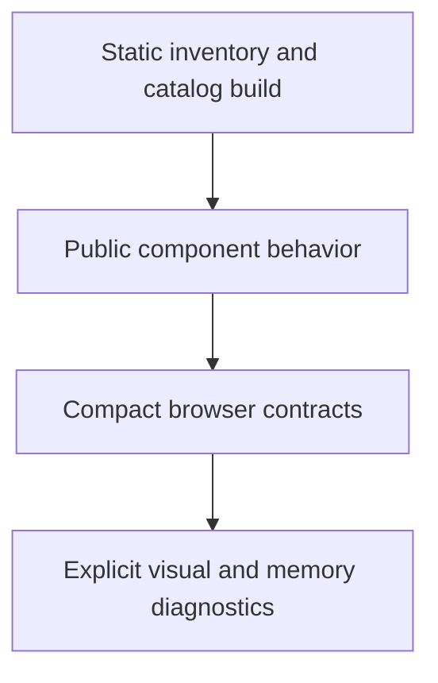

# Design: Browser Test Composition

## Overview

All examples retain static inventory and compilation coverage. A compact set of browser tests covers browser-only contracts, while visual and heap diagnostics move to explicit commands.

## Architecture



## Components

| Component         | Responsibility                                                                             | Location                        |
| ----------------- | ------------------------------------------------------------------------------------------ | ------------------------------- |
| Inventory test    | Discovers every catalog example and validates source contract                              | `test/internal/catalog.test.ts` |
| Browser runner    | Builds, serves and selects the requested browser contract files                            | `cmd/run-catalog-test.ts`       |
| Browser contracts | Tests semantic archetypes, shell, focus, responsive, lazy rendering and upload composition | `test/browser/`                 |
| Visual diagnostic | Curated screenshot baseline                                                                | `test/browser/visual.test.ts`   |
| Memory diagnostic | Lazy preview lifecycle probe                                                               | `test/browser/memory.test.ts`   |

## Data Flow

1. `bun catalog:build` compiles every lazy example and enforces bundle limits.
2. Component tests own public state and callback behavior.
3. `bun catalog:test` runs a fixed compact set of browser files before push.
4. `bun catalog:test:visual` and `bun catalog:test:memory` run diagnostic files only.

## Example Code

```ts
const BrowserContractFile = [
  "test/browser/catalog.test.ts",
  "test/browser/accessibility.test.ts",
  "test/browser/menu-focus.test.ts",
  "test/browser/upload-composition.test.ts",
  "test/browser/render-pipeline.test.ts"
] as const
```

## Risks & Mitigations

| Risk                                            | Mitigation                                                                                           |
| ----------------------------------------------- | ---------------------------------------------------------------------------------------------------- |
| Fewer axe invocations miss a unique composition | Select each semantic archetype and add a case for every new unique composition.                      |
| Diagnostics are forgotten                       | Expose explicit commands in documentation and require them for relevant change/release verification. |
| Component behavior slips from browser coverage  | Preserve existing public component behavior tests and targeted browser regressions.                  |
