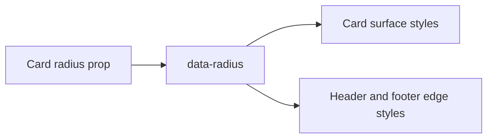

# Design: Card Radius

## Overview

Card owns its surface geometry, so `radius` is a root Card prop. The root emits radius metadata and descendant compound slots derive matching exposed-corner radii from that metadata.

## Architecture



## Components

| Component  | Responsibility                     | Location                              |
| ---------- | ---------------------------------- | ------------------------------------- |
| Card       | Select and expose radius treatment | `app/component/brand/stylex/card.tsx` |
| CardHeader | Match top exposed corners          | `app/component/brand/stylex/card.tsx` |
| CardFooter | Match bottom exposed corners       | `app/component/brand/stylex/card.tsx` |

## Data Flow

1. Consumer passes a supported `radius` value to Card.
2. Card places the value in `data-radius`.
3. StyleX applies root and compound-slot corner geometry from the ancestor value.

## Example Code

```tsx
<Card radius="none">
  <CardHeader>Square heading</CardHeader>
  <CardFooter>Square footer</CardFooter>
</Card>
```

## Risks & Mitigations

| Risk                                        | Mitigation                                                |
| ------------------------------------------- | --------------------------------------------------------- |
| Nested slots retain default rounded corners | Derive header and footer geometry from the root metadata. |
