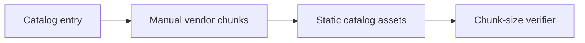

# Design: Catalog Bundle Splitting

## Overview

The catalog build assigns known heavyweight dependency families to stable manual chunks. A lightweight build script enforces a 900 kB ceiling for route-lazy catalog payloads; its entry chunk remains below Vite's 500 kB warning threshold.

## Architecture

## Risks & Mitigations

| Risk                           | Mitigation                                    |
| ------------------------------ | --------------------------------------------- |
| Splitting breaks lazy examples | Run catalog build and browser catalog checks. |
| New vendor causes regression   | Enforce the 500 kB asset ceiling after build. |
