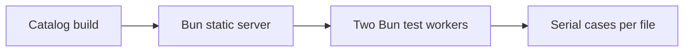

# Design: Catalog Runner Parallel

## Overview

Run two isolated Bun test workers so independent browser test files overlap, while cases within a file remain serial. Serve the built catalog through Bun instead of Vite preview.

## Architecture



## Components

| Component      | Responsibility                                 | Location                               |
| -------------- | ---------------------------------------------- | -------------------------------------- |
| Catalog runner | Serve catalog and bound parallel execution     | `cmd/run-catalog-test.ts`              |
| Runner test    | Lock command scheduling and lifecycle contract | `test/internal/catalog-runner.test.ts` |

## Data Flow

1. Build the static catalog and start Bun's static server.
2. Start Bun test with `--parallel=2`.
3. Stop the static server after the browser test process exits.

## Example Code

```ts
const test = Bun.spawn(["bun", "test", "--parallel=2", "./test/browser"])
const server = Bun.serve({ port, fetch })
```

## Risks & Mitigations

| Risk                                       | Mitigation                                |
| ------------------------------------------ | ----------------------------------------- |
| Browser cases share rendering state        | Keep cases within each test file serial.  |
| Two browser workers exceed runner capacity | Cap file workers at two.                  |
| Vite preview fails under asset load        | Serve immutable built assets through Bun. |
