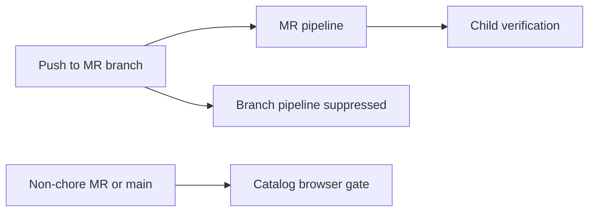

# Design: CI Catalog Scope

## Overview

Root pipeline workflow rules prefer merge-request pipelines and suppress a push pipeline for a branch with an open MR. The child catalog job remains a full browser gate, but its rules require a non-chore MR or default-branch commit.

## Architecture



## Components

| Component         | Responsibility                   | Location                               |
| ----------------- | -------------------------------- | -------------------------------------- |
| Root workflow     | Avoid duplicate pipelines        | `.gitlab-ci.yml`                       |
| Catalog job rules | Limit full browser verification  | `deployment/.gitlab-ci.yml`            |
| Regression test   | Preserve CI eligibility contract | `test/internal/catalog-runner.test.ts` |

## Data Flow

1. GitLab evaluates root workflow rules before creating a pipeline.
2. An open MR branch push is suppressed; the MR pipeline triggers the child pipeline.
3. The child catalog job checks parent pipeline context, conventional commit title, and MR/default-branch eligibility.

## Example Code

```yaml
workflow:
  rules:
    - if: '$CI_PIPELINE_SOURCE == "merge_request_event"'
    - if: "$CI_COMMIT_BRANCH && $CI_OPEN_MERGE_REQUESTS"
      when: never
```

## Risks & Mitigations

| Risk                                     | Mitigation                                                                  |
| ---------------------------------------- | --------------------------------------------------------------------------- |
| A fast path misses browser regressions   | Retain the complete suite for every non-chore MR and default-branch change. |
| Release automation bypasses verification | Source, coverage, package, and release job scope remain unchanged.          |
