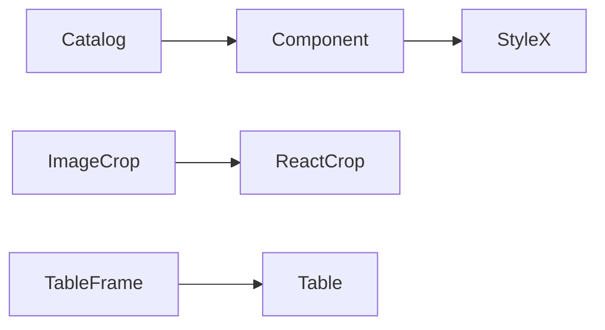

# Design: Component Variant Expansion

## Overview

Owned StyleX components receive additive variants through typed literal maps. The catalog remains the integration surface. ImageCrop delegates controlled crop selection interaction to `react-image-crop`; Bridge retains the previous file-to-PNG editor as `ImageCropEditor`.

## Architecture



## Components

| Component          | Responsibility                                        | Location                                     |
| ------------------ | ----------------------------------------------------- | -------------------------------------------- |
| Component variants | Semantic/surface presentation contracts               | `app/component/brand/stylex/`                |
| ImageCrop          | ReactCrop compatibility and Bridge export composition | `app/component/brand/stylex/image-crop.tsx`  |
| Table              | Canonical native and framed table composition         | `app/component/brand/stylex/table.tsx`       |
| TableFrame         | Deprecated compatible facade                          | `app/component/brand/stylex/table-frame.tsx` |
| Catalog examples   | Demonstrate contracts and responsive use              | `internal/catalog/example/`                  |

## Example Code

```tsx
<ImageCrop
  crop={crop}
  aspect={1}
  circularCrop
  onChange={(_, percentCrop) => setCrop(percentCrop)}>
  
</ImageCrop>

<Table variant="frame" density="compact">
  <TableHint>Scroll horizontally to view all columns.</TableHint>
  <TableViewport><table>...</table></TableViewport>
</Table>
```

## Risks & Mitigations

| Risk                                      | Mitigation                                                                               |
| ----------------------------------------- | ---------------------------------------------------------------------------------------- |
| Upstream crop styling is not package-safe | Include required upstream CSS through the published style entry and validate packed CSS. |
| Table migration breaks consumers          | Retain TableFrame names as deprecated aliases.                                           |
| Visual variants get brittle unit tests    | Use semantic/interaction tests and catalog WebView evidence.                             |
