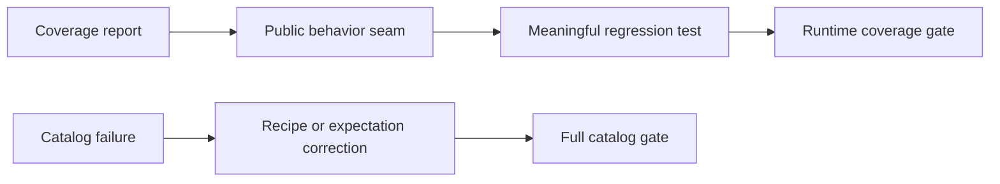

# Design: Coverage and Test Gates

Coverage is restored through existing public seams: Theme customization/context and user-visible component behavior. Browser checks use interaction and accessibility state; presentation-only declarations remain Bun.WebView evidence rather than unit assertions.

