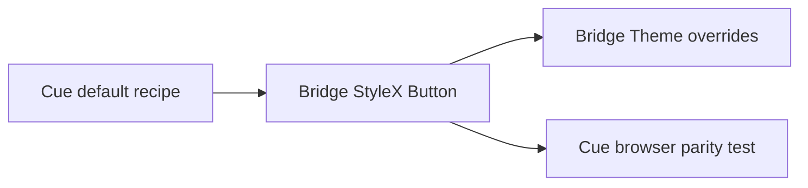

# Design: Cue Button Default Parity

## Overview

The public StyleX Button retains its Bridge theme seam while its default recipe is expressed as the Cue default contract: primary fill, primary foreground, Cue control geometry, standard Cue type, and one-pixel active press. Browser coverage checks the rendered Cue mode.

## Architecture



## Components

| Component        | Responsibility                              | Location                                |
| ---------------- | ------------------------------------------- | --------------------------------------- |
| Button           | Apply the Cue-derived public default recipe | `app/component/brand/stylex/button.tsx` |
| Cue browser test | Protect rendered default parity             | `test/browser/cue-theme.test.ts`        |

## Data Flow

1. Button resolves the default variant when no variant is supplied.
2. The default recipe resolves primary tokens from the nearest Bridge Theme.
3. Cue mode supplies Cue's semantic primary values to the recipe.

## Example Code

```tsx
<Theme mode="cue">
  <Button>Continue</Button>
</Theme>
```

## Risks & Mitigations

| Risk                                | Mitigation                                             |
| ----------------------------------- | ------------------------------------------------------ |
| Generic theme customization is lost | Preserve `themeToken` variables in the derived recipe. |
