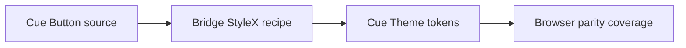

# Design: Cue Button Full Parity

## Overview

Bridge retains an independent StyleX implementation while translating Cue's complete Button recipe declaratively. The Cue theme supplies the same semantic tokens that the Cue source resolves at runtime.

## Architecture



## Components

| Component        | Responsibility                                    | Location                                |
| ---------------- | ------------------------------------------------- | --------------------------------------- |
| Button           | Translate Cue Button declarations and state rules | `app/component/brand/stylex/button.tsx` |
| Theme            | Supply exact Cue semantic values                  | `app/component/brand/stylex/theme.tsx`  |
| Cue browser test | Check rendered visual contract                    | `test/browser/cue-theme.test.ts`        |

## Data Flow

1. Public Button resolves a Cue-derived StyleX variant and size recipe.
2. The nearest Theme supplies Cue semantic values in Cue mode.
3. Browser tests verify the compiled result.

## Example Code

```tsx
<Theme mode="cue">
  <Button variant="outline" aria-expanded>
    Filter
  </Button>
</Theme>
```

## Risks & Mitigations

| Risk                                        | Mitigation                                  |
| ------------------------------------------- | ------------------------------------------- |
| A later local approximation drifts from Cue | Verify all variant families in the browser. |
