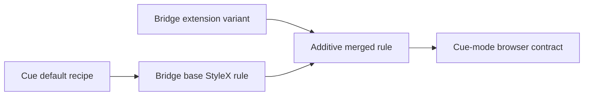

# Design: Cue Default Variant Merge

## Overview

Each affected StyleX component keeps its current public API. Its default/base style receives Cue declarations, and Bridge-only variants are composed after that base style rather than removed.



## Components

| Component | Cue default work                                   | Preserved Bridge extension   |
| --------- | -------------------------------------------------- | ---------------------------- |
| Checkbox  | Hit area, dark surface, invalid-checked priority   | Existing public props        |
| Switch    | Hit area and state-specific dark surfaces          | `sm` size                    |
| Select    | Dark trigger, icon and option descendant behavior  | `unstyled` appearance        |
| Tabs      | Default shadow, focus, indicator and icon behavior | `capsule` variant            |
| Badge     | Cue core icon and interaction behavior             | `success`, `partial-success` |
| Skeleton  | Already matches Cue's 2-second pulse timing        | Reduced-motion policy        |

## Example

```tsx
<TabsList variant="capsule">
  <TabsTrigger value="activity">Activity</TabsTrigger>
</TabsList>

<Badge variant="success">Paid</Badge>
```

Both remain Bridge public extensions while their respective base rules follow Cue.
