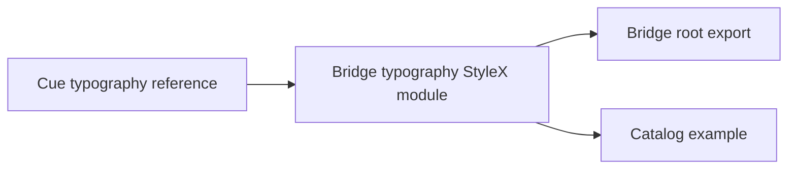

# Design: Cue Typography

## Overview

Bridge UI will own a StyleX typography module with the compact semantic API extracted from Cue. It will use existing package font and color tokens instead of importing Cue or Tailwind utilities.

## Architecture



## Components

| Component | Responsibility                  | Location                                    |
| --------- | ------------------------------- | ------------------------------------------- |
| `Heading` | Semantic heading with Cue scale | `app/component/brand/stylex/typography.tsx` |
| `Label`   | Inline semantic text wrapper    | `app/component/brand/stylex/typography.tsx` |
| `Body`    | Paragraph with Cue body leading | `app/component/brand/stylex/typography.tsx` |

## Data Flow

1. Consumers select a heading tag through `WAIHeading` or rely on the `h4` default.
2. The component combines token-backed StyleX styles with an optional caller `className`.

## Example Code

```tsx
import { Body, Heading, WAIHeading } from "@bridge/ui"

export function Profile() {
  return (
    <section>
      <Heading as={WAIHeading.H2}>Account</Heading>
      <Body>Manage account access and profile details.</Body>
    </section>
  )
}
```

## Risks & Mitigations

| Risk                           | Mitigation                                  |
| ------------------------------ | ------------------------------------------- |
| Product CSS leaks into package | Use only existing Bridge StyleX tokens.     |
| Heading structure regresses    | Test the public rendered semantic elements. |
