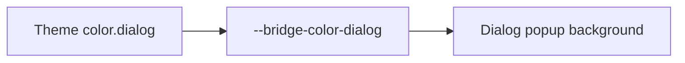

# Design: Dialog Background Token

## Overview

Dialog will read `--bridge-color-dialog` and `--bridge-color-dialog-foreground`. Each falls back to the existing surface variables, preserving all current themes unless a caller chooses a Dialog-specific override.

## Architecture



## Example Code

```tsx
<Theme theme={{ color: { dialog: "midnightblue", dialogForeground: "white" } }}>
  <DialogContent>...</DialogContent>
</Theme>
```

## Risks & Mitigations

| Risk                               | Mitigation                                    |
| ---------------------------------- | --------------------------------------------- |
| Existing Dialog appearance changes | Fall back to the existing surface color pair. |
