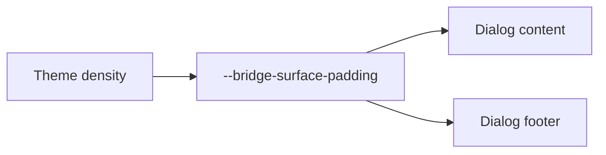

# Design: Dialog Density Padding

## Overview

`DialogContent` already uses `geometryToken.surfacePadding` for its content inset. `DialogFooter` will use that same token for its padding and negative offsets so the footer remains flush at every Theme density.

## Architecture



## Components

| Component | Responsibility                             | Location                                |
| --------- | ------------------------------------------ | --------------------------------------- |
| Dialog    | Applies shared content and footer geometry | `app/component/brand/stylex/dialog.tsx` |

## Example Code

```tsx
<Theme density={bridgeDensity.comfortable}>
  <DialogContent>
    <DialogFooter>...</DialogFooter>
  </DialogContent>
</Theme>
```

## Risks & Mitigations

| Risk                        | Mitigation                                                                                          |
| --------------------------- | --------------------------------------------------------------------------------------------------- |
| Footer loses its flush edge | Preserve the existing negative-margin structure, replacing only fixed values with the shared token. |
