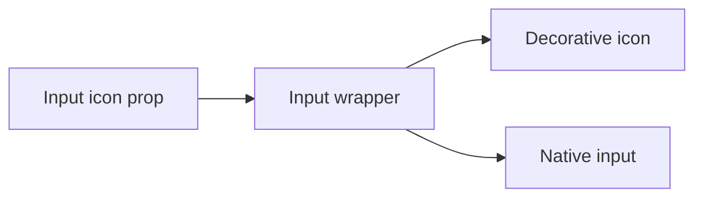

# Design: Input Icon

## Overview

Input receives an optional decorative `icon` ReactNode. When present, it renders a positioned icon wrapper and increases the input's leading padding. InputGroup remains the composition API for controls or trailing content.

## Architecture



## Components

| Component           | Responsibility                                       | Location                                     |
| ------------------- | ---------------------------------------------------- | -------------------------------------------- |
| Input               | Render icon wrapper and retain native input contract | `app/component/brand/stylex/input.tsx`       |
| Catalog example     | Show leading search icon usage                       | `internal/catalog/example/input/default.tsx` |
| Customization guide | Explain Input and InputGroup choices                 | `CUSTOMIZATION.md`                           |

## Data Flow

1. Consumer supplies `icon` to Input.
2. Input renders the icon as hidden decorative content before the native control.
3. Input preserves native props, value, label association, and ref forwarding.

## Example Code

```tsx
<Input icon={<SearchIcon />} aria-label="Search" placeholder="Search" />
```

## Risks & Mitigations

| Risk                         | Mitigation                                            |
| ---------------------------- | ----------------------------------------------------- |
| Icon affects accessible name | Mark the icon wrapper as `aria-hidden`.               |
| Need interactive adornments  | Document InputGroup as the supported composition API. |
