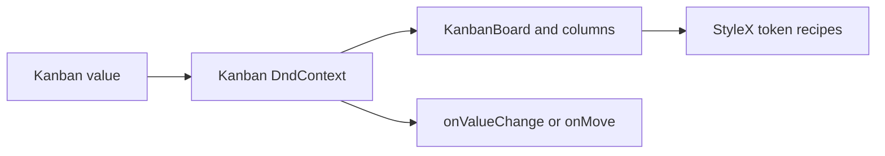

# Design: Kanban StyleX

## Overview

`Kanban` remains a controlled generic board built on dnd-kit. Its compound children define board geometry and drag handles, while StyleX owns the default token-driven presentation.

## Architecture



## Components

| Component       | Responsibility               | Location                                      |
| --------------- | ---------------------------- | --------------------------------------------- |
| Kanban          | Controlled drag coordination | `app/component/brand/stylex/kanban.tsx`       |
| Catalog example | Runnable public composition  | `internal/catalog/example/kanban/default.tsx` |

## Data Flow

1. Consumers provide column-keyed items and an item identifier.
2. A drag end either calls `onMove` with a coordinate intent or updates the controlled value.

## Example Code

```tsx
<Kanban value={columns} onValueChange={setColumns} getItemValue={(item) => item.id}>
  <KanbanBoard>{/* columns and items */}</KanbanBoard>
</Kanban>
```

## Risks & Mitigations

| Risk                                            | Mitigation                                    |
| ----------------------------------------------- | --------------------------------------------- |
| Cross-column remount interrupts pointer capture | Commit cross-column changes only at drag end. |
