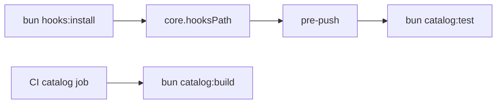

# Design: Local WebView Pre-Push

## Overview

Keep the complete catalog suite unchanged but execute it through Git's pre-push lifecycle on contributor hardware. CI retains deterministic static catalog compilation, while hook installation remains explicit to avoid publishing a package lifecycle script that mutates consumer repositories.

## Architecture



## Components

| Component      | Responsibility                                      | Location                               |
| -------------- | --------------------------------------------------- | -------------------------------------- |
| Hook           | Block push when complete WebView verification fails | `.githooks/pre-push`                   |
| Installer      | Select repository-owned Git hooks                   | `package.json`                         |
| CI catalog job | Compile and size-check static catalog output        | `deployment/.gitlab-ci.yml`            |
| Contract test  | Lock local and CI gate ownership                    | `test/internal/catalog-runner.test.ts` |

## Data Flow

1. Contributor runs `bun hooks:install` once after cloning.
2. Every normal Git push runs the complete `bun catalog:test` suite on an OS-assigned port.
3. Child CI compiles and validates the static catalog without opening WebView.

## Example Code

```sh
#!/bin/sh
exec bun catalog:test
```

## Risks & Mitigations

| Risk                                     | Mitigation                                                          |
| ---------------------------------------- | ------------------------------------------------------------------- |
| Hook is not installed                    | Document setup and lock the install command with a repository test. |
| Hook is bypassed                         | Document `--no-verify` as an explicit quality-policy bypass.        |
| Published package mutates consumer hooks | Do not use `postinstall` or `prepare`.                              |
