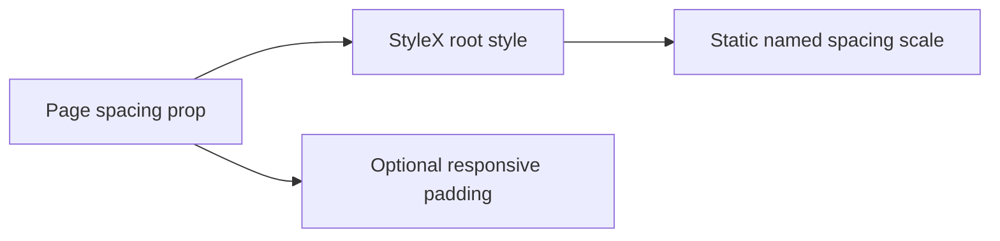

# Design: Compact Page Spacing

## Overview

`Page` uses static padding by default. Its `spacing="compact"` option applies 16px padding and `spacing="comfortable"` applies 24px padding on all four sides. `isDynamicPadding` explicitly enables responsive gutter overrides.

## Architecture



## Example Code

```tsx
<Page spacing="comfortable" isDynamicPadding>
  <PageContent>Dense content</PageContent>
</Page>
```

## Risks & Mitigations

| Risk                          | Mitigation                 |
| ----------------------------- | -------------------------- |
| Existing pages change spacing | Default remains unchanged. |
