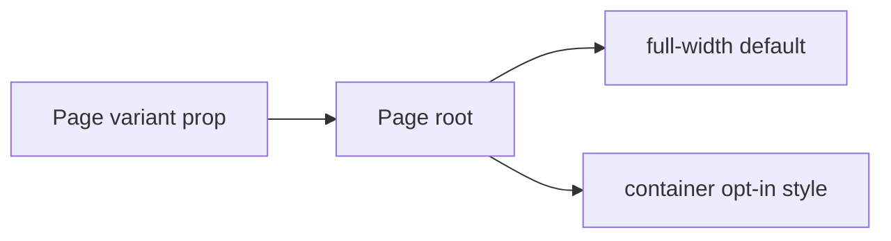

# Design: Page Layout Variant

## Overview

`Page` keeps its existing padding and content styles in its root layout. The width cap and auto inline margins move into an explicit `container` StyleX style, selected only by `variant="container"`.

## Architecture



## Components

| Component    | Responsibility                       | Location                                    |
| ------------ | ------------------------------------ | ------------------------------------------- |
| Page         | Select default or constrained layout | `app/component/brand/stylex/page.tsx`       |
| Page catalog | Demonstrate both layout modes        | `internal/catalog/example/page/spacing.tsx` |

## Data Flow

1. A consumer omits `variant` and receives a full-width page.
2. A consumer passes `variant="container"` to receive the 1480px centered layout.

## Example Code

```tsx
<Page>Full-width content</Page>
<Page variant="container">Constrained content</Page>
```

## Risks & Mitigations

| Risk                                               | Mitigation                                                                         |
| -------------------------------------------------- | ---------------------------------------------------------------------------------- |
| Existing consumers rely on the constrained layout. | Preserve it behind the explicit `container` variant and release as a minor change. |
