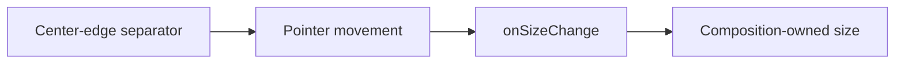

# Design: Resizable Sheet Handle

## Overview

`SheetContent` retains its `resizable` prop, but renders a pointer-driven `separator` at the center of the sheet's inner edge. Pointer movement reports only the permitted dimension to the consuming composition, which owns the rendered `size` and any persistence.

## Architecture



## Components

| Component         | Responsibility                | Location                                       |
| ----------------- | ----------------------------- | ---------------------------------------------- |
| SheetContent      | Render and handle resize drag | `app/component/brand/stylex/sheet.tsx`         |
| Resizable example | Communicate handle location   | `internal/catalog/example/sheet/resizable.tsx` |

## Example Code

```tsx
<SheetContent side="right" resizable>
  <SheetHeader>
    <SheetTitle>Inspector</SheetTitle>
  </SheetHeader>
</SheetContent>
```

## Risks & Mitigations

| Risk                                    | Mitigation                                                |
| --------------------------------------- | --------------------------------------------------------- |
| The handle is obscured by sheet content | Position it above content at the centered inner edge.     |
| A dimension must persist                | The consuming composition owns `size` and `onSizeChange`. |
