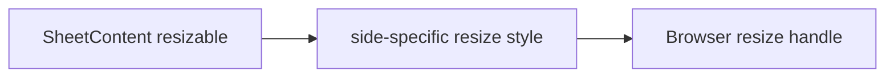

# Design: Resizable Sheet

## Overview

`SheetContent` gains a `resizable` boolean. The existing fixed side placement remains responsible for anchoring and animation; the opt-in style adds the native resize axis and a minimum usable dimension.

## Architecture



## Components

| Component     | Responsibility                      | Location                                       |
| ------------- | ----------------------------------- | ---------------------------------------------- |
| SheetContent  | Render the opt-in resize contract   | `app/component/brand/stylex/sheet.tsx`         |
| Sheet example | Demonstrate a resizable right sheet | `internal/catalog/example/sheet/resizable.tsx` |

## Data Flow

1. Consumer passes `resizable` and a sheet `side`.
2. `SheetContent` combines the corresponding native resize style with its existing placement style.

## Example Code

```tsx
<SheetContent side="right" resizable>
  <SheetHeader>
    <SheetTitle>Inspector</SheetTitle>
  </SheetHeader>
</SheetContent>
```

## Risks & Mitigations

| Risk                                           | Mitigation                                                  |
| ---------------------------------------------- | ----------------------------------------------------------- |
| The resize handle could move the anchored edge | Use side-specific resize axes that preserve the fixed edge. |
