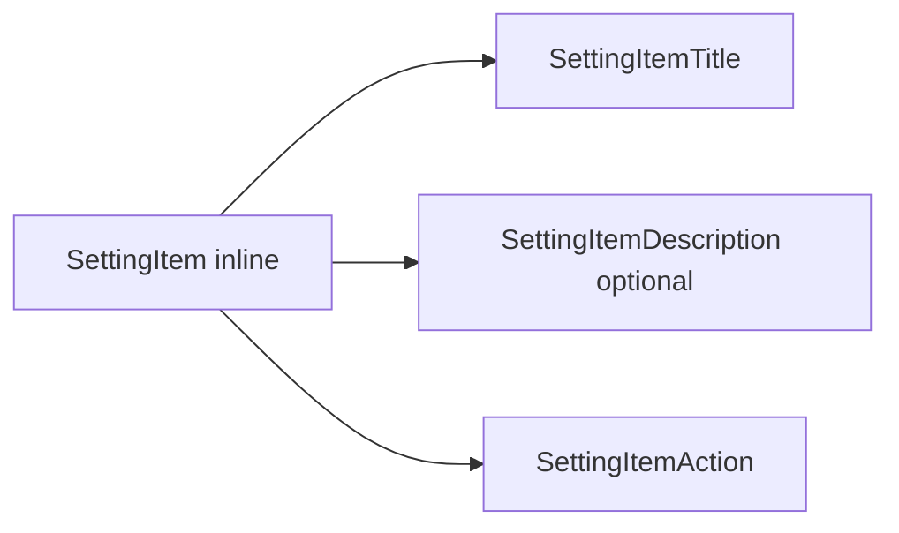

# Design: Setting Item Inline Variant

## Overview

`SettingItem` remains a structural compound component. Its new `inline` variant presents its title and caller-owned action on one compact row; descriptions remain optional supporting content below the title.

## Architecture



## Components

| Component              | Responsibility                                      | Location                                           |
| ---------------------- | --------------------------------------------------- | -------------------------------------------------- |
| SettingItem            | Select default or compact inline row layout         | `app/component/brand/stylex/setting-item.tsx`      |
| SettingItemAction      | Host caller-provided value or control               | `app/component/brand/stylex/setting-item.tsx`      |
| Inline catalog example | Demonstrate account rows and long-value containment | `internal/catalog/example/setting-item/states.tsx` |

## Data Flow

1. The consumer selects `variant="inline"`.
2. The component applies compact label-and-action layout styling.
3. Consumer-owned values and edit controls render through `SettingItemAction`.

## Example Code

```tsx
<SettingItem variant="inline">
  <SettingItemTitle>Email</SettingItemTitle>
  <SettingItemAction>alexsmith.mobbin@gmail.com</SettingItemAction>
</SettingItem>
```

## Risks & Mitigations

| Risk                             | Mitigation                                                |
| -------------------------------- | --------------------------------------------------------- |
| Long values overflow narrow rows | Allow action content to shrink and wrap at any character. |
