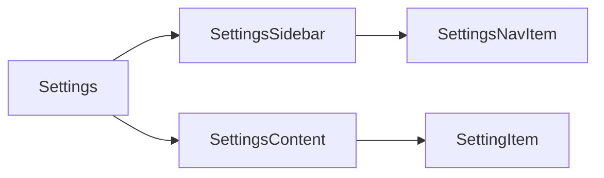

# Design: Settings Composition

## Overview

`Settings` provides structure only: callers own the selected section and all setting content. It lays out a navigation column and content at desktop widths, while `SettingsSidebar` provides the same caller navigation in a modal dialog under 768px.

## Architecture



## Components

| Component       | Responsibility                                   | Location                                  |
| --------------- | ------------------------------------------------ | ----------------------------------------- |
| Settings        | Responsive layout boundary                       | `app/component/brand/stylex/settings.tsx` |
| SettingsSidebar | Desktop navigation or small-layout dialog picker | `app/component/brand/stylex/settings.tsx` |
| SettingsNavItem | Accessible caller-controlled section button      | `app/component/brand/stylex/settings.tsx` |
| SettingsContent | Content landmark                                 | `app/component/brand/stylex/settings.tsx` |

## Data Flow

1. The consumer supplies navigation items and tracks active selection.
2. `SettingsSidebar` presents them inline at desktop widths or in a dialog at tablet and below.
3. Selecting an item invokes the consumer callback and closes the small-layout picker.

## Example Code

```tsx
<Settings>
  <SettingsSidebar title="General">
    <SettingsNavItem isActive onClick={() => setSection("general")}>
      General
    </SettingsNavItem>
  </SettingsSidebar>
  <SettingsContent aria-label="General settings">
    <SettingItem>...</SettingItem>
  </SettingsContent>
</Settings>
```

## Risks & Mitigations

| Risk                                                    | Mitigation                                                           |
| ------------------------------------------------------- | -------------------------------------------------------------------- |
| Navigation becomes inaccessible in a constrained layout | Use the existing accessible dialog primitive and a labelled trigger. |
