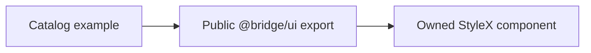

# Design: StyleX-Only Example

## Overview

The catalog loads examples once through the public `@bridge/ui` export, which already resolves to owned StyleX components. Route pathname no longer selects modules, source disclosure, status copy, or iframe implementation.

## Architecture



## Components

| Component        | Responsibility                                  | Location                            |
| ---------------- | ----------------------------------------------- | ----------------------------------- |
| Catalog app      | Load and display one example implementation     | `internal/catalog/main.tsx`         |
| Route regression | Prove root and legacy URL share StyleX behavior | `test/browser/stylex-route.test.ts` |

## Data Flow

1. Catalog discovers each example once.
2. Example imports public `@bridge/ui` StyleX exports.
3. Preview iframe uses the catalog root path regardless of outer compatibility URL.

## Example Code

```tsx
const modules = import.meta.glob<{ default: ComponentType }>("./example/*/*.tsx")
```

## Risks & Mitigations

| Risk                                  | Mitigation                                            |
| ------------------------------------- | ----------------------------------------------------- |
| Existing `/style-x` links break       | Retain it as a same-implementation compatibility URL. |
| Catalog regresses to generated source | Assert StyleX marker on both URL forms.               |
