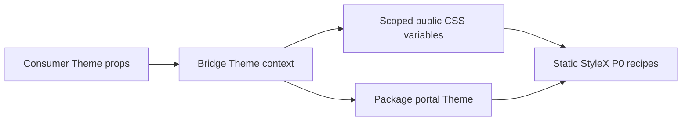

# Design: Theme Customization

## Overview

`Theme` resolves a mode, density preset, and optional typed override object. It writes only documented custom properties on its scoped root. Owned P0 recipes read semantic properties rather than fixed shared geometry or color literals.

## Architecture



## Components

| Component      | Responsibility                                 | Location                               |
| -------------- | ---------------------------------------------- | -------------------------------------- |
| Theme          | Resolve inherited mode, density, and overrides | `app/component/brand/stylex/theme.tsx` |
| P0 recipes     | Consume semantic color/geometry variables      | `app/component/brand/stylex/*.tsx`     |
| Consumer guide | Explain supported setup and coverage           | `CUSTOMIZATION.md`                     |

## Data Flow

1. A consumer renders `Theme` with optional `density` and `theme` values.
2. Theme merges nested override values with the nearest context and writes public CSS variables.
3. P0 static recipes inherit the variables; package portals receive the same context.

## Example Code

```tsx
const ProductTheme = {
  color: { primary: "oklch(0.54 0.2 265)" },
  radius: { control: "0.375rem", surface: "0.75rem" }
} as const satisfies BridgeThemeOverride

<Theme density="compact" theme={ProductTheme}>
  <App />
</Theme>
```

## Risks & Mitigations

| Risk                                 | Mitigation                                                         |
| ------------------------------------ | ------------------------------------------------------------------ |
| Product relies on internal selectors | Document only `--bridge-*` variables as stable.                    |
| Density reduces usable controls      | Keep control height and focus geometry package-owned.              |
| Portal loses a nested theme          | Resolve and inherit Theme context within each package portal root. |
