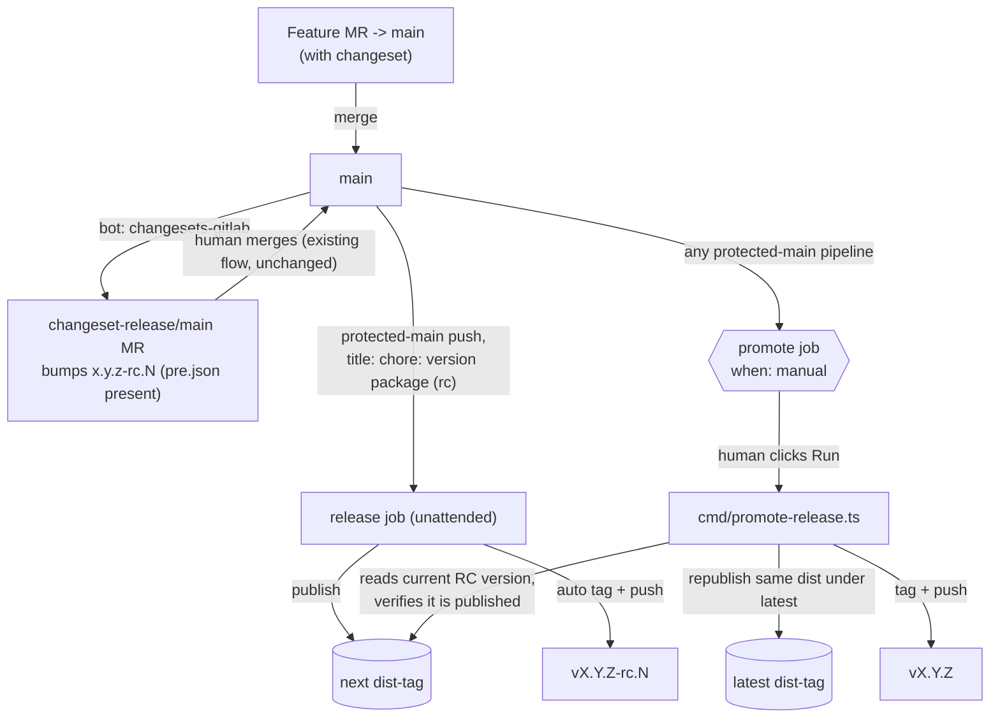

# Design: RC Release Promotion

## Overview

`.changeset/pre.json` already flips `bun changeset version` into RC-bump mode with no other code
change — `cmd/publish-package.ts` already branches `next` vs `latest` purely off `-rc.` in the
version string, and the existing fast-path regex (`chore: version package( \(rc\))?`) already
matches the `(rc)`-suffixed title `changesets-gitlab` produces in pre mode. So Phase 1 (permanent RC)
is a one-file commit. Phase 2 adds a new manual `promote` job + script that republishes the exact
already-verified RC artifact under `latest` and pushes a stable tag, reusing `publish-package.ts`'s
temp-directory/registry-verify pattern.

## Architecture



## Components

| Component                         | Responsibility                                                                             | Location                       |
| --------------------------------- | ------------------------------------------------------------------------------------------ | ------------------------------ |
| `.changeset/pre.json`             | Puts `main` in permanent Changesets pre-release mode, tag `rc`                             | `.changeset/pre.json` (new)    |
| `promote` job                     | Manual deploy-stage job exposed on every protected-`main` pipeline                         | `deployment/.gitlab-ci.yml`    |
| `cmd/promote-release.ts`          | Strips `-rc.N`, republishes the already-built `dist/` under `latest`, tags + pushes stable | `cmd/promote-release.ts` (new) |
| `test/internal/release.test.ts`   | Assert `promote` job rule/config and refusal-without-protected-branch guard                | existing file, extended        |
| `test/internal/promotion.test.ts` | Unit-test `promoteRelease()` scenarios (mirrors `publication.test.ts`)                     | new file                       |

## Data Flow

1. Feature MR merges to `main` (existing, unchanged) with a changeset.
2. `changesets-gitlab` bot sees pending changesets + `.changeset/pre.json` present → opens/updates
   `changeset-release/main` titled `Release @bridge/ui (rc)`, bumping `package.json` to
   `x.y.z-rc.N`.
3. Human merges that MR (existing manual click, unchanged) → commit title `chore: version package
(rc)` lands on protected `main`.
4. Existing `source`/`coverage` fast-path (`release-fast-path` spec) skips verify for that exact
   title; `release` job runs unattended, publishes `x.y.z-rc.N` under `next`, tags + pushes
   `vx.y.z-rc.N` — all existing code, zero changes required.
5. At any later point, a human opens the latest protected-`main` pipeline (any pipeline — a feature
   merge, another RC bump, doesn't matter) and clicks ▶ on the new `promote` job.
6. `cmd/promote-release.ts` reads `package.json` at that commit; if it's not `x.y.z-rc.N`, refuses
   ("No RC version to promote"). Confirms `x.y.z-rc.N` is actually published under `next` via the
   same registry-lookup pattern as `publish-package.ts`. Builds a temp directory with
   `package.json` version rewritten to `x.y.z` (no other content change — same `dist/` that already
   passed the RC's registry-install verification), publishes under `latest`, re-verifies install,
   then creates and pushes tag `vx.y.z`.
7. If `vx.y.z` already exists or is already published, the job no-ops safely (same idempotency
   pattern as `publish-package.ts`'s existing-tag/already-released handling).

## Example Code

```ts
// cmd/promote-release.ts
import { cp, mkdtemp, rm } from "node:fs/promises"
import { tmpdir } from "node:os"
import path from "node:path"

type ProcessResult = {
  exitCode: number | null
  stdout?: { toString: () => string }
  stderr?: { toString: () => string }
}

type PromoteDependency = {
  cwd?: string
  env?: Record<string, string | undefined>
  fetch?: typeof fetch
  log?: (message: string) => void
  spawn?: (
    command: string[],
    options: { cwd?: string; stdout: "pipe" | "inherit"; stderr: "pipe" | "inherit" }
  ) => ProcessResult
}

export async function promoteRelease(dependency: PromoteDependency = {}): Promise<void> {
  const cwd = dependency.cwd ?? process.cwd()
  const env = dependency.env ?? process.env
  const fetchRegistry = dependency.fetch ?? fetch
  const log = dependency.log ?? console.log
  const spawn = dependency.spawn ?? ((command, options) => Bun.spawnSync(command, options))

  if (
    env.CI_COMMIT_REF_PROTECTED !== "true" ||
    !env.CI_DEFAULT_BRANCH ||
    env.CI_COMMIT_BRANCH !== env.CI_DEFAULT_BRANCH
  ) {
    throw new Error("Protected default branch required")
  }
  const manifest = await Bun.file(path.join(cwd, "package.json")).json()
  const match = /^(\d+\.\d+\.\d+)-rc\.\d+$/.exec(manifest.version)
  if (!match) throw new Error("No RC version to promote")
  const stableVersion = match[1]
  const stableTag = `v${stableVersion}`

  const { CI_API_V4_URL, CI_PROJECT_ID, CI_JOB_TOKEN, GITLAB_TOKEN, CI_SERVER_HOST, CI_PROJECT_PATH } = env
  if (!CI_API_V4_URL || !CI_PROJECT_ID || !CI_JOB_TOKEN) throw new Error("GitLab job context required")
  if (!GITLAB_TOKEN || !CI_SERVER_HOST || !CI_PROJECT_PATH) throw new Error("GitLab push context required")
  const registry = `${CI_API_V4_URL}/projects/${CI_PROJECT_ID}/packages/npm/`
  if (URL.parse(registry)?.protocol !== "https:") throw new Error("HTTPS registry required")

  const lookup = async (version: string) => {
    const response = await fetchRegistry(`${registry}${encodeURIComponent(manifest.name)}`, {
      headers: { "JOB-TOKEN": CI_JOB_TOKEN }
    })
    if (!response.ok && response.status !== 404) throw new Error(`Registry lookup failed: ${response.status}`)
    const metadata = response.ok ? await response.json() : {}
    return Boolean(metadata.versions?.[version])
  }

  if (!(await lookup(manifest.version))) throw new Error("RC version is not published yet; nothing to promote")

  if (!(await lookup(stableVersion))) {
    const directory = await mkdtemp(path.join(tmpdir(), "bridge-promote-"))
    const npmrc = `@bridge:registry=${registry}\n${registry.replace(/^https:/, "")}:_authToken=\${CI_JOB_TOKEN}\n`
    try {
      await cp(path.join(cwd, "dist"), path.join(directory, "dist"), { recursive: true })
      await Bun.write(
        path.join(directory, "package.json"),
        JSON.stringify({
          ...manifest,
          version: stableVersion,
          scripts: {},
          devDependencies: {},
          publishConfig: { registry, tag: "latest" }
        })
      )
      await Bun.write(path.join(directory, ".npmrc"), npmrc)
      const publication = spawn(["bun", "publish", "--tag", "latest", "--registry", registry], {
        cwd: directory,
        stdout: "inherit",
        stderr: "inherit"
      })
      if (publication.exitCode !== 0) throw new Error("Stable publication failed")
      const fixture = path.join(directory, "fixture")
      await Bun.write(
        path.join(fixture, "package.json"),
        JSON.stringify({
          private: true,
          dependencies: { "@bridge/ui": stableVersion, react: "^19", "react-dom": "^19" }
        })
      )
      await Bun.write(path.join(fixture, ".npmrc"), npmrc)
      const install = spawn(["bun", "install", "--ignore-scripts"], {
        cwd: fixture,
        stdout: "inherit",
        stderr: "inherit"
      })
      if (install.exitCode !== 0) throw new Error("Registry install failed; package may already be published")
      const verify = spawn(
        [
          "bun",
          "-e",
          'const ui = await import("@bridge/ui"); if (!ui.Button || !ui.UploadList) throw new Error("Missing package export")'
        ],
        { cwd: fixture, stdout: "inherit", stderr: "inherit" }
      )
      if (verify.exitCode !== 0) throw new Error("Registry import failed; package already published")
    } finally {
      await rm(directory, { recursive: true, force: true })
    }
  } else {
    log("Stable version already published; nothing to publish")
  }

  const existingTag = spawn(["git", "rev-parse", "--verify", `refs/tags/${stableTag}^{commit}`], {
    cwd,
    stdout: "pipe",
    stderr: "pipe"
  })
  if (existingTag.exitCode === 0) {
    log(`Tag ${stableTag} already exists; nothing to push`)
    return
  }
  const createTag = spawn(["git", "tag", stableTag], { cwd, stdout: "pipe", stderr: "pipe" })
  if (createTag.exitCode !== 0) throw new Error("Stable published but tag creation failed")
  const pushUrl = `https://oauth2:${GITLAB_TOKEN}@${CI_SERVER_HOST}/${CI_PROJECT_PATH}.git`
  const pushTag = spawn(["git", "push", pushUrl, stableTag], { cwd, stdout: "pipe", stderr: "pipe" })
  if (pushTag.exitCode !== 0) throw new Error("Stable tag created locally but push failed")
  log(`New tag: ${stableTag}`)
}

if (import.meta.main) await promoteRelease()
```

```yaml
# deployment/.gitlab-ci.yml, appended after `release:`
promote:
  stage: deploy
  resource_group: package-release
  rules:
    - if: '$CI_COMMIT_BRANCH == $CI_DEFAULT_BRANCH && $CI_COMMIT_REF_PROTECTED == "true"'
      when: manual
  script:
    - test -n "$GITLAB_TOKEN"
    - bun run build
    - bun cmd/promote-release.ts
```

## Risks & Mitigations

| Risk                                                                                                                        | Mitigation                                                                                                                                                                                                                                                      |
| --------------------------------------------------------------------------------------------------------------------------- | --------------------------------------------------------------------------------------------------------------------------------------------------------------------------------------------------------------------------------------------------------------- |
| Human clicks `promote` while `main`'s current commit is mid-feature-merge, not an RC bump                                   | Script's regex guard throws "No RC version to promote" before any publish attempt — safe no-op failure, matches existing `publish-package.ts` "Stable or RC version required" precedent.                                                                        |
| `promote` republishes a version that was never actually verified as an RC (e.g. registry lookup race)                       | Script explicitly checks the RC version is already in the registry (`lookup(manifest.version)`) before proceeding — refuses if the RC publish hasn't completed.                                                                                                 |
| Double-click / concurrent promote runs                                                                                      | `resource_group: package-release` (same group the `release` job already uses) serializes them; idempotent already-published/already-tagged checks make a second run a safe no-op.                                                                               |
| New push mechanism (`oauth2:$GITLAB_TOKEN@...`) diverges from `changesets-gitlab`'s existing username-lookup push mechanism | Both authenticate with the same `GITLAB_TOKEN` secret already present in CI variables (proven working — `release` job asserts `test -n "$GITLAB_TOKEN"` today); `oauth2:` is GitLab's documented generic token-username convention and needs no extra API call. |
| Manual job visible to any project member who can run pipelines (GitLab default)                                             | Explicitly out of scope per `proposal.md` — flagged as a follow-up access-control decision, not blocking this proposal.                                                                                                                                         |
