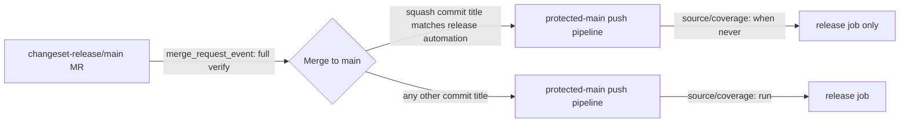

# Design: Release Merge Fast Path

## Overview

`deployment/.gitlab-ci.yml` already discriminates the release-MR bot commit by title for the
`catalog` job (`$CI_COMMIT_TITLE !~ /^chore(\([^)]*\))?:/`). We extend the same discrimination,
but scoped precisely to the known automation title, to the `source` and `coverage` jobs — and only
when the pipeline is a protected-`main` push (never on the MR pipeline itself, so pre-merge
verification is untouched).

## Architecture



## Components

| Component           | Responsibility                                                                      | Location                        |
| ------------------- | ----------------------------------------------------------------------------------- | ------------------------------- |
| `source` job rule   | Add `when: never` branch matching release-automation commit title on protected main | `deployment/.gitlab-ci.yml`     |
| `coverage` job rule | Same as above                                                                       | `deployment/.gitlab-ci.yml`     |
| `release.test.ts`   | Assert new rule text is present                                                     | `test/internal/release.test.ts` |

## Data Flow

1. `changesets-gitlab` opens/updates `changeset-release/main` MR; every push to that MR triggers a
   `merge_request_event` pipeline, which still runs `source`/`coverage`/`catalog` fully (rule at
   `.gitlab-ci.yml:24` unaffected).
2. User (or automation) merges that MR into `main` with squash commit title `INPUT_COMMIT: "chore:
version package"` (RC variant appends ` (rc)`).
3. The resulting protected-`main` push pipeline triggers `verify-and-release` (`.gitlab-ci.yml:17`),
   which triggers the child pipeline (`deployment/.gitlab-ci.yml`) as `parent_pipeline`.
4. New rule order on `source`/`coverage`:
   - `when: never` if `$CI_PIPELINE_SOURCE == "parent_pipeline" && $CI_COMMIT_BRANCH ==
$CI_DEFAULT_BRANCH && $CI_COMMIT_REF_PROTECTED == "true" && $CI_COMMIT_TITLE =~
/^chore: version package( \(rc\))?$/`
   - otherwise existing `if: '$CI_PIPELINE_SOURCE == "parent_pipeline"'` rule applies (run).
5. `release` job (deploy stage) is unaffected by this change; its own protected-branch rule already
   gates it, and GitLab stage ordering still runs `deploy` after `verify` stage jobs report (skipped
   jobs count as passed for `strategy: depend`).

## Example Code

```yaml
# deployment/.gitlab-ci.yml
source:
  stage: verify
  rules:
    - if: '$CI_PIPELINE_SOURCE == "parent_pipeline" && $CI_COMMIT_BRANCH == $CI_DEFAULT_BRANCH && $CI_COMMIT_REF_PROTECTED == "true" && $CI_COMMIT_TITLE =~ /^chore: version package( \(rc\))?$/'
      when: never
    - if: '$CI_PIPELINE_SOURCE == "parent_pipeline"'
  script:
    - bun fmt --check
    - bun lint
    - bun typecheck
    - bun boundary
    - bun run build
    - bun test
    - bun coverage:brand
    - bun verify:package
    - bun verify:tree-shaking

coverage:
  stage: verify
  rules:
    - if: '$CI_PIPELINE_SOURCE == "parent_pipeline" && $CI_COMMIT_BRANCH == $CI_DEFAULT_BRANCH && $CI_COMMIT_REF_PROTECTED == "true" && $CI_COMMIT_TITLE =~ /^chore: version package( \(rc\))?$/'
      when: never
    - if: '$CI_PIPELINE_SOURCE == "parent_pipeline"'
  script:
    - bun coverage:runtime
  artifacts:
    when: always
    paths:
      - coverage/
    expire_in: 7 days
```

## Risks & Mitigations

| Risk                                                                                                             | Mitigation                                                                                                                                                                                                                                                                                                                                                                                                     |
| ---------------------------------------------------------------------------------------------------------------- | -------------------------------------------------------------------------------------------------------------------------------------------------------------------------------------------------------------------------------------------------------------------------------------------------------------------------------------------------------------------------------------------------------------- |
| Commit title drifts from `changesets-gitlab` default and no longer matches                                       | Regex anchored on the exact `INPUT_COMMIT` string already declared in the same file; a follow-up test cross-checks both strings so drift fails CI, not silently skips verification incorrectly.                                                                                                                                                                                                                |
| Someone manually pushes a commit literally titled `chore: version package` to `main` bypassing real verification | Existing `release` job independently re-derives/publishes from `bun release:version`/`bun release:publish`, which no-ops if there is nothing to release; worst case is a wasted skip, not an unverified publish, since publish still requires the actual package to build/exist from a prior verified state. Accepted given this mirrors the already-established `catalog` job precedent for `chore:` commits. |
| Skip rule matches unintended pipeline sources (e.g. tag pipeline)                                                | Condition also requires `CI_PIPELINE_SOURCE == "parent_pipeline"`, matching existing job scoping exactly.                                                                                                                                                                                                                                                                                                      |
