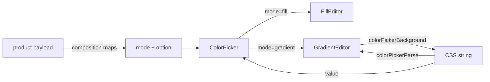

# Design: Color picker gradient editor

## Overview

`ColorPicker` is a thin discriminated entry: `mode` selects the option type, default preset, parser and editor, then delegates to a generic `Picker<Option>`. Serialization and parsing live in `color-picker-value.ts`, which has no React code and is re-exported.



## Components

| Export                                         | Responsibility                              | Location                                           |
| ---------------------------------------------- | ------------------------------------------- | -------------------------------------------------- |
| `ColorPicker`                                  | Mode dispatch, swatch group, custom popover | `app/component/brand/stylex/color-picker.tsx`      |
| `colorPickerBackground` / `colorPickerParse`   | Option to/from CSS                          | `app/component/brand/stylex/color-picker-value.ts` |
| `colorPickerPreset`, `colorPickerDefaultLabel` | System palette and fallback copy            | `color-picker.tsx`                                 |

## Example Code

```tsx
<ColorPicker
  mode="gradient"
  aria-label="Background"
  option={[{ type: "gradient", value: "wheel", label: "Wheel", kind: "conic", stop: ["#f00", "#00f", "#f00"] }]}
  value={value}
  onValueChange={(css, option) => save(css)}
/>
```

## Risks & Mitigations

| Risk                                     | Mitigation                                                          |
| ---------------------------------------- | ------------------------------------------------------------------- |
| Native color input rejects non-hex stop  | Editor shows `#000000` for non-hex stops; CSS keeps the rest intact |
| Arbitrary persisted CSS cannot be edited | Parser returns `null`; value not rendered as a custom swatch        |
| Nested functions in stops (`rgb(...)`)   | Depth-aware comma split                                             |
