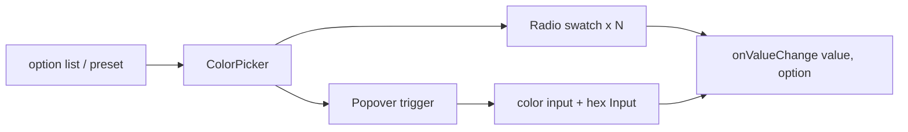

# Design: Color picker

## Overview

`ColorPicker` wraps Base UI `RadioGroup` / `Radio` so each swatch is a native-semantics radio with arrow-key roving focus. A trailing Popover trigger (outside the radio set) opens a custom-color panel. Options are data: `fill` (`color`) or `gradient` (`stop[]`, `shape` default `linear`, `angle` default 135). `colorPickerBackground(option)` converts an option into CSS `background`.



## Components

| Component / export      | Responsibility                          | Location                                      |
| ----------------------- | --------------------------------------- | --------------------------------------------- |
| `ColorPicker`           | Swatch group, selection, custom popover | `app/component/brand/stylex/color-picker.tsx` |
| `colorPickerPreset`     | System `gradient` and `fill` palette    | same                                          |
| `colorPickerBackground` | Option -> CSS background                | same                                          |

## Example Code

```tsx
import { ColorPicker, colorPickerPreset } from "@bridge/ui/color-picker"

<ColorPicker aria-label="Background" size="lg" layout="grid" column={6} defaultValue="white" />
<ColorPicker aria-label="Accent" size="sm" layout="row" option={colorPickerPreset.fill} custom={false} />
<ColorPicker
  aria-label="Brand"
  option={[
    { type: "fill", value: "ink", label: "Ink", color: "#111827" },
    { type: "gradient", value: "dawn", label: "Dawn", stop: ["#f97316", "#facc15"], shape: "radial" }
  ]}
  value={value}
  onValueChange={(next, option) => setValue(next)}
/>
```

## Risks & Mitigations

| Risk                                    | Mitigation                                                      |
| --------------------------------------- | --------------------------------------------------------------- |
| White swatch invisible on light surface | Inset hairline border on every swatch                           |
| Selected ring color clashes with theme  | `--bridge-color-picker-ring` var, fallback `themeToken.primary` |
| Row layout clips ring/shadow            | Row scroller keeps padding around swatches                      |
| Invalid custom hex emits garbage        | Commit only `#rrggbb`; expose `aria-invalid` otherwise          |
